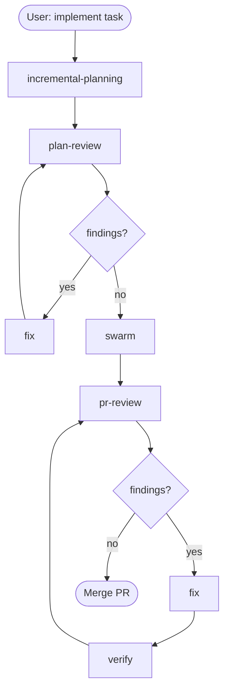
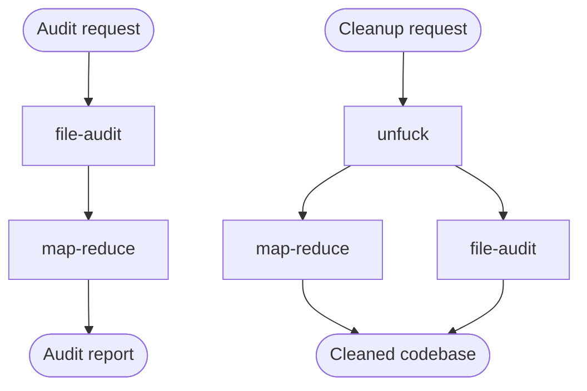
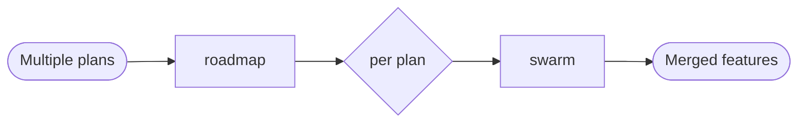
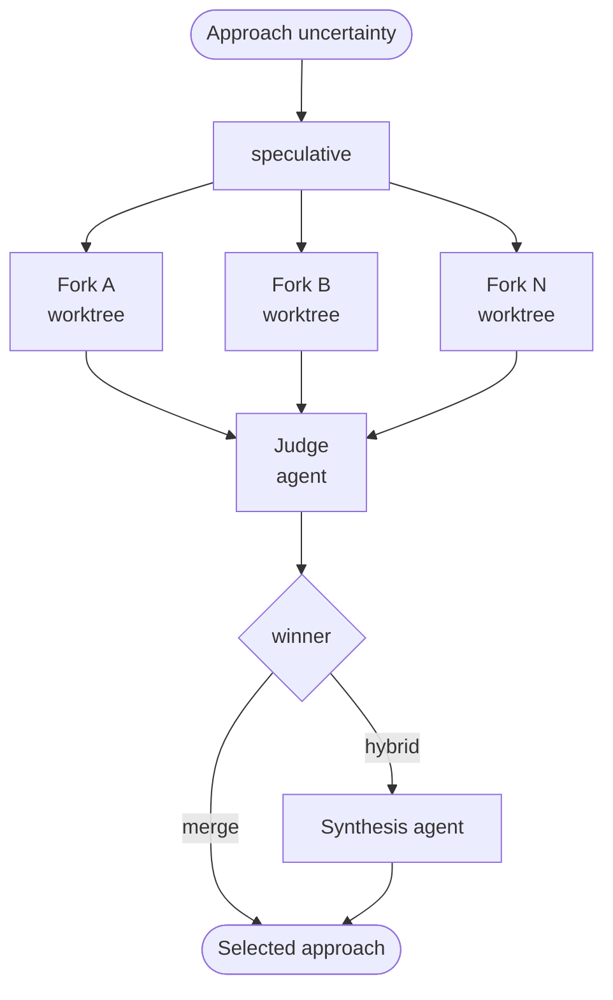
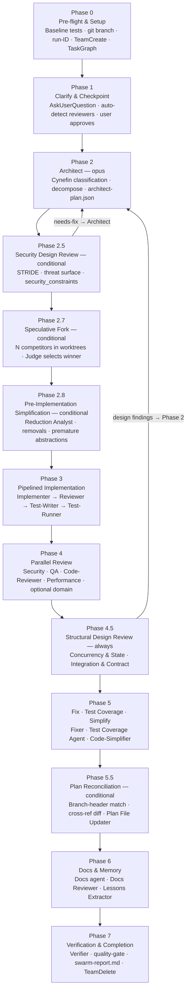
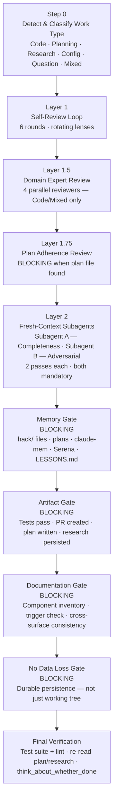

# ATLAS — Architecture, Topology, and Lifecycle of All Skills

<!-- Last updated: 2026-04-04 — run /project:generate-atlas to refresh -->

This document is the canonical map of every workflow, skill, agent, and artifact in the private-claude-marketplace. It answers three questions: **what exists**, **how things connect**, and **what each skill produces**.

Mermaid diagrams and prose are hand-authored and preserved on regeneration. Sections wrapped in `<!-- BEGIN:AUTO ... -->` / `<!-- END:AUTO ... -->` markers are regenerated by `/project:generate-atlas`.

---

## Table of Contents

1. [Primary Development Workflow](#1-primary-development-workflow)
2. [Secondary Workflows](#2-secondary-workflows)
3. [Utility and On-Demand Skills](#3-utility-and-on-demand-skills)
4. [Swarm Internal Pipeline](#4-swarm-internal-pipeline)
5. [Quality Gate Internal Pipeline](#5-quality-gate-internal-pipeline)
6. [Skill Outputs and Artifacts](#6-skill-outputs-and-artifacts)
7. [code-quality Plugin — Agents](#7-code-quality-plugin--agents)
8. [code-quality Plugin — Skills](#8-code-quality-plugin--skills)
9. [code-quality Plugin — Commands](#9-code-quality-plugin--commands)
10. [dev-guard Plugin — Hooks](#10-dev-guard-plugin--hooks)
11. [dev-guard Plugin — Commands](#11-dev-guard-plugin--commands)
12. [git-tools Plugin](#12-git-tools-plugin)
13. [github-mcp Plugin](#13-github-mcp-plugin)
14. [LSP Plugins](#14-lsp-plugins)
15. [Shared Reference Docs](#15-shared-reference-docs)
16. [MCP Server Integrations](#16-mcp-server-integrations)
17. [Marketplace Registry](#17-marketplace-registry)

---

## 1. Primary Development Workflow

The main path from idea to merged PR. Each skill hands off structured output to the next.



**Handoffs:**
- `incremental-planning` → writes plan file to `hack/plans/`
- `plan-review` → terminal report (findings); feeds `/fix`
- `swarm` → feature branch + PR; invokes `quality-gate` internally in Phase 7
- `pr-review` → terminal report (findings); feeds `/fix`
- `/fix` → working-tree edits; user reviews and commits

---

## 2. Secondary Workflows

### 2.1 Bug Investigation


`bug-investigation` persists findings in `BUGS.md` (cross-session). `/fix` reads `BUGS.md` to implement all fixes.

---

### 2.2 Codebase Maintenance



`file-audit` analyzes every file and builds a symbol/dependency inventory. `map-reduce` scales analysis across 20+ files using parallel mapper agents. `unfuck` orchestrates both into a full cleanup swarm.

---

### 2.3 Multi-Plan Orchestration



`roadmap` sequences multiple plan files, resolves dependency order, and feeds each plan into a separate `/swarm` run.

---

### 2.4 Competing Approaches



`speculative` runs N competing implementations in isolated git worktrees and uses a Judge (opus) to select or synthesize the best approach.

---

### 2.5 Session Lifecycle


`session-start` (git-tools hook) injects git instructions at session start. `quality-gate` is the mandatory pre-completion gate. `session-end` updates `hack/` memory files (TODO, PROJECT, SESSIONS, NEXT).

---

## 3. Utility and On-Demand Skills

Skills that operate independently — either invoked manually or triggered automatically (PROACTIVE).

| Skill | Trigger | Description |
|-------|---------|-------------|
| `deep-research` | Manual | 5-hop web research (40+ sources). Supports External mode (web) and Bridged mode (internal project investigation + external best-practices). |
| `business-panel` | Manual | Multi-stakeholder analysis simulating CEO, CTO, PM, Security, and other organizational roles. |
| `reflect` | Manual; also spawned by `unfuck` | Mid-task Serena metacognitive checkpoint: task adherence, information sufficiency, completion verification. |
| `index-repo` | Manual | Generates `PROJECT_INDEX.md` (~3K tokens) for token-efficient codebase orientation. |
| `uv-python` | **PROACTIVE** — auto-triggers on any Python work | Enforces `uv run` / `uv add` for all Python operations. Prevents raw `python`/`pip` usage. |
| `lsp-navigation` | **PROACTIVE** — auto-triggers on code navigation | Semantic code navigation via LSP. Prefer over grep for symbol definitions, references, call hierarchies. |
| `test-runner` | Manual; also spawned by `swarm` Phase 3 and Phase 7 | Efficient pytest/pre-commit execution patterns. Sequential execution, targeted re-runs, smart failure handling. |
| `git-history` | Manual | Non-interactive git history manipulation via git-branchless. Rewording, squashing, splitting, reordering commits without interactive prompts. |

---

## 4. Swarm Internal Pipeline

<!-- diagram:swarm-phases phases:13 source:code-quality/skills/swarm/SKILL.md -->

The `/swarm` skill runs a 21+ agent pipeline in 13 phases. The Lead (Phase 0) orchestrates all agents — it never implements, reviews, or tests code directly.



### Phase Categories

**Always runs:** Phase 0, 1, 2, 3, 4, 4.5, 7

**Conditional:**

<!-- BEGIN:AUTO swarm-phases -->

| Phase | Name | Condition | Skip When |
|-------|------|-----------|-----------|
| 0 | Pre-flight & Setup | Always | Never |
| 1 | Clarify & Checkpoint | Always | Never |
| 2 | Architect | Always | Never |
| 2.5 | Security Design Review | Conditional | Config-only, docs-only, or test-only changes without auth/data/network/API surface. Clear-domain (Cynefin) tasks without those surfaces. |
| 2.7 | Speculative Fork | Conditional | Architect did not flag `speculative_fork_recommended: true` AND Lead does not identify 2+ incompatible approach choices. Single-component tasks. User specified an approach. |
| 2.8 | Pre-Implementation Simplification | Conditional | Config-only, docs-only, or test-only changes. Plan modifies fewer than 3 files. |
| 3 | Pipelined Implementation | Always | Never (Test-Writer skippable with `--skip-tests` or config/docs changes) |
| 4 | Parallel Review | Always | Never |
| 4.5 | Structural Design Review | Always | Never |
| 5 | Fix, Test Coverage & Simplify | Conditional | All Phase 4 and 4.5 reviewers report zero findings. (Test Coverage Agent and Code-Simplifier have their own inner skip conditions.) |
| 5.5 | Plan Reconciliation | Conditional | No incremental plan file found in `{memory_dir}/plans/` matching the feature branch. |
| 6 | Docs & Memory | Conditional | Purely internal refactor with no public API, documented behavior, feature, or component changes. Memory updates always run. |
| 7 | Verification & Completion | Always | Never |

<!-- END:AUTO swarm-phases -->

---

## 5. Quality Gate Internal Pipeline

<!-- diagram:quality-gate gates:4 rounds:6 domain-reviewers:4 source:code-quality/skills/quality-gate/SKILL.md -->

The `/quality-gate` skill is the mandatory pre-completion gate for all work types. It runs after implementation, `/swarm` Phase 7, `/fix`, and any significant deliverable.



### Layer Details

<!-- BEGIN:AUTO quality-gate-layers -->

| Layer | Name | Type | Description |
|-------|------|------|-------------|
| Step 0 | Detect & Classify | Setup | Determines work type (Code, Planning, Research, Config, Question, Mixed) and selects the lens set for Layer 1. |
| Layer 1 | Self-Review Loop | Process — 6 rounds mandatory | Rotates through 6 adversarial lenses: Correctness, Completeness, Robustness, Simplicity (BLOCKING — Round 4), Adversarial, Structural (Code/Mixed only). Each round: task adherence check → apply lens → fix immediately → action audit → done check. |
| Layer 1.5 | Domain Expert Review | Process — Code/Mixed only | Spawns 4 reviewers in parallel: Security (`code-quality:security`), QA (`code-quality:qa`), Performance (`code-quality:performance`), Code-Reviewer (`code-quality:code-reviewer`). All `needs-fix` findings resolved before Layer 2. |
| Layer 1.75 | Plan Adherence Review | Gate — BLOCKING when plan found | Spawns `code-quality:plan-adherence` (opus) when `{memory_dir}/plans/` contains a file matching the current git branch. Cannot proceed without completing plan verification. |
| Layer 2 | Fresh-Context Subagent Reviews | Process — NEVER optional | Subagent A (Completeness, opus, 2 passes) and Subagent B (Adversarial, opus, 2 passes). Pass 2 resumes via agent ID (not name). Must wait for Pass 2 response before proceeding to gates. |
| Memory Gate | Memory Gate | Gate — BLOCKING | Updates hack/ memory files (TODO, PROJECT, NEXT, SESSIONS), plan files, claude-mem observations, Serena memories, auto-memory. |
| Artifact Gate | Artifact Gate | Gate — BLOCKING | Ensures work products are not lost. Code: tests pass, changes on pushed branch with PR. Planning: plan file written, tasks concrete. Research: findings documented persistently. Re-verifies project-specific rules (version bumps, registry entries). |
| Documentation Gate | Documentation Gate | Gate — BLOCKING | Uses `documentation-taxonomy.md` triggers. Checks component inventory on disk vs documented. Verifies cross-surface consistency (README ↔ manifest ↔ registry). |
| No Data Loss Gate | No Data Loss Gate | Gate — BLOCKING | Confirms all artifacts are in a durable, externally-trackable location. "Working tree only" fails this gate. Code: pushed branch + open PR. Planning: `{memory_dir}/plans/`. Research: `{memory_dir}/research/` or PROJECT.md or claude-mem. |
| Final Verification | Final Verification | Completion check | Runs test suite + lint (code), re-reads plan end-to-end (planning), re-reads findings vs original question (research). `think_about_whether_you_are_done` metacognitive check. |

<!-- END:AUTO quality-gate-layers -->

**Stop Hook Safety Net:** A global Stop hook in `dev-guard` (`stop-hook.py` + `stop-hook-llm.py`) catches premature completion claims that bypass this skill. It uses deterministic signal detection (<200ms) and delegates to an LLM evaluation when signals warrant it. Fails open on infrastructure errors.

---

## 6. Skill Outputs and Artifacts

<!-- BEGIN:AUTO skill-artifacts -->

| Skill | Output Type | File Path Pattern | Format | Consumed By |
|-------|-------------|-------------------|--------|-------------|
| `bug-investigation` | Bug tracking file | `{cwd}/BUGS.md` | Markdown — root cause + resolution plan per bug | `/fix` (reads BUGS.md across sessions) |
| `business-panel` | Analysis report | Terminal output only | Structured prose — per-role perspective + synthesis | Human review |
| `deep-research` | Research report | `{memory_dir}/research/{run-id}-<topic>.md` | Markdown — findings, sources, synthesis | Human review; PROJECT.md decisions |
| `file-audit` | Audit inventory | `{cwd}/FILE_AUDIT.md` or `{cwd}/.file-audit/` | Markdown — symbol inventory, duplicates, issues per file | `map-reduce` (bulk transformation); human review |
| `fix` | Working-tree edits | Modified source files (no fixed path) | Source code changes | User review → commit; `quality-gate` for verification |
| `incremental-planning` | Plan file | `{memory_dir}/plans/{run-id}-<topic>.md` | Markdown — tasks, file structure, breakpoints, assumptions | `plan-review`; `swarm` (Phase 4 plan adherence); `quality-gate` Layer 1.75 |
| `index-repo` | Project index | `{cwd}/PROJECT_INDEX.md` | Markdown — compact orientation (~3K tokens) | Agent context injection; `swarm`; `unfuck` |
| `lsp-navigation` | Navigation results | Terminal output only | Symbol definitions, references, call hierarchy | Human or agent navigation |
| `map-reduce` | Synthesis report | `{memory_dir}/map-reduce/{run-id}/map-reduce-report.md` or terminal | Markdown — reducer synthesis of mapper findings | Human review; `unfuck` orchestration |
| `plan-review` | Review report | Terminal output only (never modifies plan files) | Structured terminal — findings by reviewer, categorized | `/fix` (reads from session context); human review |
| `pr-review` | Review report | Terminal output only (never comments on GitHub) | Structured terminal — findings by type, categorized | `/fix` (reads from session context); human review |
| `quality-gate` | Gate report | Terminal output (structured quality gate output block) | Fixed-format gate report with layer statuses and counts | Human review; gates block until resolved |
| `reflect` | Reflection output | Terminal output only | Metacognitive assessment — on-track, sufficient info, done check | Course correction; resuming work; `unfuck` |
| `roadmap` | Roadmap document | `{memory_dir}/plans/roadmap-<topic>.md` | Markdown — sequenced plans, dependencies, parallel workstreams | `/swarm` (per-plan execution); human orchestration |
| `speculative` | Selected implementation | Winning worktree merged to feature branch | Source code in winning worktree; `judge-result.json` | `/swarm` Phase 2.7 (winning approach → architect-plan.json) |
| `swarm` | Audit trail + PR | `{memory_dir}/swarm/{run-id}/swarm-report.md`; feature branch + PR | Markdown report; JSON audit files; source code | Human review; `quality-gate`; `pr-review` |
| `test-runner` | Test results | Terminal output only | pytest / pre-commit results — pass/fail counts | `swarm` Phase 3 (Test-Runner) and Phase 7 (Verifier); human review |
| `unfuck` | Cleaned codebase | Modified source files (no fixed path) | Source code changes + cleanup report | Human review → commit; `quality-gate` for verification |
| `uv-python` | Enforcement (no file output) | N/A — in-session constraint enforcement | N/A | All Python tool calls in session |
| `git-history` | Git history changes | Modified git commits (no file path) | Rewritten git history via git-branchless | Human review; push after verification |

<!-- END:AUTO skill-artifacts -->

---

## 7. code-quality Plugin — Agents

<!-- BEGIN:AUTO code-quality-agents -->

8 specialized agents in `code-quality/agents/`. Each has a frontmatter-enforced model. All reference `code-quality/references/finding-classification.md` for finding classification and anti-deferral protocol.

| Agent | Model | Tools | Spawned By | Trigger / Purpose |
|-------|-------|-------|-----------|-------------------|
| `architect` | **opus** (enforced — cannot be downgraded) | Read, Glob, Grep, LSP, WebSearch, WebFetch | `swarm` Phase 2; `unfuck`; direct user request | System architecture design, technology evaluation, Cynefin classification, component decomposition. Writes `architect-plan.json`. Stays active through Phase 3 for clarification. |
| `code-reviewer` | sonnet | Read, Glob, Grep, LSP | `swarm` Phase 4; `quality-gate` Layer 1.5; `pr-review` | Holistic code quality review: plan alignment, style, maintainability, readability, project convention compliance. |
| `code-simplifier` | sonnet | Read, Glob, Grep, LSP, Edit, Write | `swarm` Phase 5.3; `quality-gate` Round 4 (Simplicity lens); `unfuck` | Simplifies recently modified code: removes dead code, premature abstractions, unnecessary complexity. Default posture is removal, not refactoring. |
| `performance` | sonnet | Read, Glob, Grep, LSP, Bash, WebSearch | `swarm` Phase 4; `quality-gate` Layer 1.5; direct user request | Performance bottleneck identification: profiling, N+1 queries, memory leaks, caching, concurrency, algorithm optimization. |
| `plan-adherence` | **opus** | Read, Glob, Grep, Bash, LSP, AskUserQuestion, SendMessage | `swarm` Phase 4 (when plan file found); `quality-gate` Layer 1.75 | Extracts every task/checkbox from a plan file, verifies each against `git diff` and source code, escalates unverified items via AskUserQuestion. |
| `qa` | sonnet | Read, Glob, Grep, LSP, Bash | `swarm` Phase 4; `quality-gate` Layer 1.5; direct user request | Test strategy, coverage analysis, code smell detection, technical debt identification, maintainability assessment. |
| `security` | sonnet | Read, Glob, Grep, LSP, WebSearch | `swarm` Phases 2.5 and 4; `quality-gate` Layer 1.5; direct user request | OWASP Top 10, authentication/authorization patterns, STRIDE threat modeling, secrets management, injection vulnerabilities, security headers. |
| `test-runner` | **haiku** (execution-only) | Bash, Read, Grep, TodoWrite | `swarm` Phases 3 and 7; `quality-gate` Final Verification | Runs pytest and pre-commit sequentially. Reports failures with specific test paths. Does NOT fix code — hands off to Fixer. |

<!-- END:AUTO code-quality-agents -->

---

## 8. code-quality Plugin — Skills

<!-- BEGIN:AUTO code-quality-skills -->

19 skills in `code-quality/skills/`. See Section 3 (Utility Skills) and Sections 4–5 (Swarm, Quality Gate) for workflow diagrams. See Section 6 (Skill Artifacts) for output types.

| Skill | Inputs | Agents Spawned | Reference Docs Used | Key Cross-References |
|-------|--------|----------------|--------------------|--------------------|
| `bug-investigation` | User bug reports (conversational) | Background investigator agents (general-purpose) | — | Writes `BUGS.md`; `/fix` reads it cross-session |
| `business-panel` | User question / topic | None (inline personas) | — | Terminal output only |
| `deep-research` | Research topic; mode (External / Bridged) | Multiple web research agents | — | Bridged mode reads project files first |
| `file-audit` | Codebase files (Glob) | Parallel analyzer agents per file | `references/analyzer-prompt.md`, `references/issue-types.md` | Output consumed by `map-reduce`; `unfuck` orchestrates both |
| `fix` | Session findings (from `pr-review`, `plan-review`, `bug-investigation`) | Background investigator agents per finding | `references/investigator-prompt.md` | In-session only (except BUGS.md); never auto-commits |
| `incremental-planning` | User task description; clarifying questions | Per-task quality reviewer (sonnet subagent) | `references/lessons-template.md`, `references/task-reviewer-prompt.md` | Writes plan to `{memory_dir}/plans/`; consumed by `plan-review`, `swarm` Phase 4, `quality-gate` Layer 1.75 |
| `index-repo` | Codebase (Glob/Read) | None | — | Writes `PROJECT_INDEX.md`; consumed by `swarm`, `unfuck` |
| `lsp-navigation` | Symbol name / file / location | None | — | PROACTIVE; LSP tool for semantic navigation |
| `map-reduce` | Workload description; file list | Mapper agents (parallel, per chunk); Reducer agent (synthesis) | `references/agent-prompts.md`, `references/communication-schema.md`, `references/fidelity-guide.md` | Consumed by `unfuck`; used for 20+ file workloads |
| `plan-review` | Plan file path | 6 parallel reviewers (feasibility, scope, dependencies, unknown unknowns, architect, security) + verification agent | `references/reviewer-prompts.md` | Terminal output only; findings fed to `/fix` |
| `pr-review` | PR URL or diff | 6 parallel reviewers (security, QA, performance, code quality, correctness, plan adherence) + verification agent | `references/reviewer-prompts.md` | Terminal output only; findings fed to `/fix` |
| `quality-gate` | Session work (auto-detected type) | 4 domain reviewers (Layer 1.5); plan-adherence (Layer 1.75); 2 fresh-context subagents (Layer 2) | `references/lens-rubrics.md`, `references/subagent-prompts.md` | Invoked by `swarm` Phase 7; Stop hook in `dev-guard` as safety net |
| `reflect` | Current session state | None (uses Serena MCP tools) | — | Manual; also spawned by `unfuck` |
| `roadmap` | Multiple plan files in `{memory_dir}/plans/` | Dependency analysis agents; roadmap updater | `references/phase-schema.md` | Sequences plans for `swarm` execution |
| `speculative` | Task + N competing approaches | N Competitor agents (sonnet, isolated worktrees); Judge agent (opus) | `references/agent-prompts.md`, `references/communication-schema.md` | Integrated into `swarm` Phase 2.7 |
| `swarm` | User implementation task | 21+ specialized agents across 13 phases | `references/agent-prompts.md`, `references/communication-schema.md`, `references/orchestration-playbook.md`, `references/pipeline-model.md`, `references/cynefin-reference.md` | Invokes `quality-gate` in Phase 7; reads plan files for Phase 4 plan adherence |
| `test-runner` | Test suite / pre-commit config | None (runs Bash directly) | — | Manual; spawned by `swarm` Phases 3 and 7 |
| `unfuck` | Codebase root | Full swarm of discovery + implementation agents | `references/ai-slop-checklist.md`, `references/discovery-agents.md`, `references/external-tools.md`, `references/implementation-agents.md`, `references/orchestration-playbook.md` | Orchestrates `file-audit`, `map-reduce`, `reflect`, `code-simplifier`, `architect`, `security`, `qa`, `code-reviewer`, `test-runner` |
| `uv-python` | Python tool call / script / bash command | None | `references/command-mappings.md`, `references/pep723-examples.md` | PROACTIVE; enforces `uv run` / `uv add` for all Python ops |

<!-- END:AUTO code-quality-skills -->

---

## 9. code-quality Plugin — Commands

<!-- BEGIN:AUTO code-quality-commands -->

4 commands in `code-quality/commands/` (flat convention — no subdirectories).

| Command | Invocation | Description |
|---------|-----------|-------------|
| `lsp-status` | `/global-commands:lsp-status` or `/project:lsp-status` | Checks LSP feature flag (`ENABLE_LSP_TOOL`), lists enabled LSP plugins, verifies prerequisites (uvx, npx, gopls, rust-analyzer), tests LSP tool availability, prints structured status table for all 5 language servers. |
| `review-project` | `/global-commands:review-project` or `/project:review-project` | Comprehensive project review: legacy format migration (CONTEXT.md+NOTES.md → PROJECT.md), claim verification against codebase, document hygiene (content placement audit, session archiving), TODO validation, user clarification before changes. Uses LSP + Grep to verify what was claimed vs. what actually exists. |
| `session-end` | `/global-commands:session-end` | Syncs project memory before ending session: updates PROJECT.md (decisions, gotchas), TODO.md (mark completed with dates, add new), SESSIONS.md (3-5 bullet summary), NEXT.md (pointer only), extracts principle-level lessons to LESSONS.md. Fails open if memory dir not found. |
| `session-start` | `/global-commands:session-start` | Loads project context at session start: detects memory dir, reads NEXT.md + PROJECT.md + LESSONS.md (selective — NOT TODO.md or SESSIONS.md), checks CONTRIBUTING.md, runs git status, presents structured orientation. For new projects: interviews user, creates `hack/`, initializes all 4 memory files. |

<!-- END:AUTO code-quality-commands -->

---

## 10. dev-guard Plugin — Hooks

<!-- BEGIN:AUTO dev-guard-hooks -->

dev-guard v1.52.0. All hooks run via `uv run` for zero-dependency execution. The guard centralizes policy enforcement: tool selection, commit validation, MCP access control, and stop-gate quality enforcement.

### Claude Code Hooks (hooks.json)

| Event | Matcher | Script | Timeout | Purpose |
|-------|---------|--------|---------|---------|
| `SessionStart` | (all) | `tool-selection-guard.py --validate` | default | Validates guard rules DB on session start; warns if rules are stale or DB is corrupt. |
| `PreToolUse` | `Bash` | `tool-selection-guard.py` | default | Enforces command-guard-rules.json: blocks/asks for dangerous shell commands (rm -rf, git reset --hard, cat/grep/sed in place of dedicated tools, etc.). 28 gh rules + glab/oc rules. |
| `PreToolUse` | `Write` | `tool-selection-guard.py` | default | Blocks writes to protected paths (e.g., `~/.claude/plugins/`). |
| `PreToolUse` | `Edit` | `tool-selection-guard.py` | default | Blocks edits to protected paths. |
| `PreToolUse` | `NotebookEdit` | `tool-selection-guard.py` | default | Blocks notebook edits to protected paths. |
| `PreToolUse` | `EnterPlanMode` | `tool-selection-guard.py` | default | Blocks native plan mode (user uses `/incremental-planning` skill instead). |
| `PreToolUse` | `WebFetch` | `tool-selection-guard.py` | default | URL allowlist/denylist enforcement; guards against fetching sensitive internal URLs. |
| `PreToolUse` | `Bash` (2nd entry) | `pre-push-review.sh` | default | Intercepts `git push` commands; triggers pre-push review workflow before push executes. |
| `PreToolUse` | `mcp__.*` | `tool-selection-guard.py` | default | MCP tool guard: auto-approves 101 read-only tools (8 servers, via `mcp_constants.py`); passes unknown tools through to settings.json. `permissionDecision: "allow"` for known read-only — NOT exit 0 (which is passthrough, not approval). |
| `PostToolUse` | `Bash` | `validate-commit-message.sh` | default | After git commit, validates message against Conventional Commits format; fails if message doesn't match. |
| `PostToolUse` | `Bash` | `tool-selection-guard.py` | default | Post-execution audit for Bash: logs command outcomes for guard-stats. |
| `PostToolUse` | `WebFetch` | `tool-selection-guard.py` | default | Post-fetch audit. |
| `PostToolUse` | `Read` | `tool-selection-guard.py` | default | Post-read audit: detects when Read is used on paths that should use dedicated tools. |
| `Stop` | (all) | `stop-hook.py` | **60s** | Quality stop gate. Stdlib-only (<200ms) deterministic triage: loop guard, transcript delta, signal detection (write tools, MCP writes, completion claims, git diff hash change). Delegates to `stop-hook-llm.py` (claude-sonnet-4-6 via Vertex AI) when signals warrant. Fails open on infrastructure errors. |
| `SessionEnd` | (all) | `tool-selection-guard.py --session-end` | default | Session-end cleanup: persists guard state, logs session summary to guard-stats DB. |

**Note:** `SubagentStop` hook (subagent-stop-hook.py, 30s timeout) — present in dev-guard 1.53.0 (not yet in this worktree at v1.52.0). Validates FixSummary from subagent stop events.

### MCP Guard — Servers Covered (mcp_constants.py)

101 read-only tools across 8 MCP servers, auto-approved by `tool-selection-guard.py` via server-qualified keys (`server_id__func_name` format — prevents server spoofing):

| Server ID | Tools Auto-Approved | Notes |
|-----------|--------------------|----|
| `serena` | 13 tools (activate_project, find_symbol, get_symbols_overview, search_for_pattern, etc.) | Write tools (replace_symbol_body, insert_after_symbol, etc.) go through settings.json |
| `plugin_claude-mem_mcp-search` | 6 tools (get_observations, search, smart_outline, smart_search, smart_unfold, timeline) | Read-only memory search |
| `context7` | 2 tools (resolve-library-id, query-docs) | Library docs lookup |
| `sequential-thinking` | 1 tool (sequentialthinking) | Structured reasoning |
| `playwright` | 4 tools (browser_snapshot, browser_console_messages, browser_network_requests, browser_tabs) | Read-only browser inspection |
| `plugin_hcm-jira-administrator-agent_mcp-atlassian-prod` | 21 tools (13 Jira + 8 Confluence) | All write Jira/Confluence tools require user approval |
| `metadata-service` | 3 tools (get_cluster_info, get_cluster_cves, list_clusters) | Cluster metadata read |
| `plugin_github-mcp_github` | 51 tools (all read — actions, issues, PRs, code security, etc.) | Write operations use gh CLI; MCP is read-only via X-MCP-Readonly header |

<!-- END:AUTO dev-guard-hooks -->

---

## 11. dev-guard Plugin — Commands

<!-- BEGIN:AUTO dev-guard-commands -->

2 commands in `dev-guard/commands/` (subdirectory convention — each command in its own subdirectory: `trust/COMMAND.md`, `guard-stats/COMMAND.md`).

| Command | Invocation | Arguments | Description |
|---------|-----------|-----------|-------------|
| `trust` | `/trust` | `action` (required: add/remove/list); `rule_name` (required for add/remove); `--scope` (always/session); `--match` (case-insensitive substring pattern); `--session-id` | Manages trust rules for dev-guard ask prompts. Trusted rules auto-approve without user prompt (shows `[trusted]` in reason). Only `ask`-type rules can be trusted — block rules are safety-critical and cannot be bypassed. Match pattern is substring, not regex. |
| `guard-stats` | `/guard-stats` | `days` (optional, default 7) | Runs `guard-stats.py` to show actionable dev-guard metrics: guard decisions (blocks/asks/allows by rule), trust opportunities (rules asked 50+ times), RTK compression stats, stop hook pass/error rates, session friction rates. Follows up with specific, implementable recommendations (not vague advice). |

<!-- END:AUTO dev-guard-commands -->

---

## 12. git-tools Plugin

<!-- BEGIN:AUTO git-tools -->

git-tools v2.1.0. Provides git workflow automation: dynamic SessionStart instructions, non-interactive history manipulation, commit review, and CONTRIBUTING.md generation.

### Skill

| Skill | Inputs | Output | Reference Docs |
|-------|--------|--------|---------------|
| `git-history` | git-branchless commands (Bash) | Rewritten git history | `BRANCHLESS.md` — exhaustive reference for git-branchless: reword, move, split, squash, recover. Covers non-interactive alternatives to `git rebase -i`, `git add -p`, `git revise`. |

### Commands

| Command | Description |
|---------|-------------|
| `review-commits` | AI-assisted commit review for PR readiness. Analyzes commits on current branch: message format (Conventional Commits), scope accuracy, atomic commit sizing, no debug code, no secrets. Before creating a PR, not during active development. |
| `contributing` | Generates or updates `CONTRIBUTING.md` with Conventional Commits standards. Scans git history for actual usage patterns, discovers scopes, produces project-specific commit conventions. |

### Claude Code Hooks (hooks.json)

| Event | Matcher | Script | Purpose |
|-------|---------|--------|---------|
| `SessionStart` | (all) | `scripts/git-instructions.sh` | Injects dynamic git workflow instructions at session start. Script is bash 3.2 compatible (`#!/usr/bin/env bash`, no `wait -n`). Content varies by repo state (worktree, branch, upstream). Controlled by `includeGitInstructions: false` in settings.json (git-tools provides its own). |

### Git Hooks (pre-commit framework — NOT Claude hooks)

These are standard git hooks installed via `.pre-commit-config.yaml`, not Claude Code hooks.

| Hook | Stage | Purpose |
|------|-------|---------|
| `pre-commit.sh` | pre-commit (runs last in stage) | Timestamped marker setter. Writes `~/.cache/hook-checks/{repo-hash}.mark` with `timestamp|commit-sha`. Cross-platform sha256 (sha256sum / shasum). Fast-exits for batch operations (cherry-pick, rebase, merge, revert, bisect). Atomic write via temp file + mv. |
| `prepare-commit-msg.sh` | prepare-commit-msg | Defense-in-depth safety. Detects when pre-commit hooks were bypassed (no marker). Enforces: direct-to-main blocking, conflict marker detection, Conventional Commits format validation. Cannot be bypassed with `--no-verify` (runs in prepare-commit-msg stage, which `--no-verify` does not skip). |

<!-- END:AUTO git-tools -->

---

## 13. github-mcp Plugin

<!-- BEGIN:AUTO github-mcp -->

github-mcp v1.0.0. Provides a read-only GitHub MCP server via the GitHub Copilot MCP endpoint.

### MCP Server Configuration (.mcp.json)

| Field | Value |
|-------|-------|
| Server type | `http` |
| URL | `https://api.githubcopilot.com/mcp/` |
| Auth | `Bearer ${GITHUB_PERSONAL_ACCESS_TOKEN}` (Classic PAT required — fine-grained PATs have org-bound limitations) |
| Read-only enforcement | `X-MCP-Readonly: true` header — server rejects all write operations at the protocol level |
| Toolsets enabled | 13: `default, actions, orgs, labels, notifications, discussions, gists, projects, code_security, secret_protection, dependabot, security_advisories, github_support_docs_search` |

### Enabled Toolsets (13)

`default` (core repo ops) · `actions` (workflow runs, job logs) · `orgs` (org membership, teams) · `labels` (issue/PR labels) · `notifications` (GitHub notifications) · `discussions` (repo discussions) · `gists` (gist read) · `projects` (GitHub Projects) · `code_security` (code scanning alerts) · `secret_protection` (secret scanning) · `dependabot` (dependency alerts) · `security_advisories` (global + repo advisories) · `github_support_docs_search`

### Claude Code Hook (hooks.json)

| Event | Purpose |
|-------|---------|
| `SessionStart` | Injects hint: "Use `mcp__github__*` tools for reading GitHub data (PRs, issues, actions, code security, notifications, discussions). Use `gh` CLI for write operations. For `raw.githubusercontent.com` URLs, use `mcp__github__get_file_contents` instead of WebFetch." |

### Usage Notes

- All 51 GitHub read tools are auto-approved by dev-guard's MCP guard (server key: `plugin_github-mcp_github`)
- Write operations (create PR, merge, create issue) must use `gh` CLI — MCP server enforces read-only
- Classic PAT required in `GITHUB_PERSONAL_ACCESS_TOKEN` env var — OAuth flow is broken for this endpoint

<!-- END:AUTO github-mcp -->

---

## 14. LSP Plugins

<!-- BEGIN:AUTO lsp-plugins -->

5 LSP plugins providing language server integration. Each plugin's `.claude-plugin/plugin.json` registers the server; the actual LSP binary is sourced at runtime via the execution method.

| Plugin | Language | Version | Execution Method | Language Server Binary | Config Approach |
|--------|----------|---------|-----------------|----------------------|----------------|
| `pyright-uvx` | Python | 1.0.0 | `uvx --from pyright pyright-langserver` (always-latest, no install needed) | `pyright-langserver` | Zero-config; pyright auto-discovers `pyrightconfig.json` or `pyproject.toml` |
| `vtsls-npx` | TypeScript / JavaScript | 1.0.0 | `npx @vtsls/language-server` (always-latest, no install needed) | `vtsls` | Auto-discovers `tsconfig.json`; falls back to implicit project |
| `gopls-go` | Go | 1.0.0 | System `gopls` on PATH (install: `go install golang.org/x/tools/gopls@latest`) | `gopls` | Auto-discovers `go.mod`; workspace mode for multi-module repos |
| `vscode-html-css-npx` | HTML / CSS | 1.0.0 | `npx vscode-langservers-extracted` (always-latest, no install needed) | `vscode-html-language-server` + `vscode-css-language-server` | Embedded schemas; no project config required |
| `rust-analyzer-rustup` | Rust | 1.0.0 | `rustup component add rust-analyzer` then system `rust-analyzer` on PATH | `rust-analyzer` | Auto-discovers `Cargo.toml`; workspace-aware |

All 5 LSP plugins require `ENABLE_LSP_TOOL=1` in `~/.claude/settings.json`. Use `/lsp-status` to verify installation. Invoked by the `lsp-navigation` skill (PROACTIVE) and any agent with `LSP` in its allowed-tools list.

<!-- END:AUTO lsp-plugins -->

---

## 15. Shared Reference Docs

<!-- BEGIN:AUTO reference-docs -->

33 reference documents total: 5 top-level (code-quality/references/), 27 skill-level (code-quality/skills/*/references/), 1 companion (git-tools).

### Top-Level References (code-quality/references/)

| File | Defines | Consumed By |
|------|---------|-------------|
| `dependency-evaluation.md` | Checklist for evaluating third-party libraries vs. custom implementation: recency, popularity, complexity trade-offs | `swarm` Phase 2.8 Reduction Analyst; `unfuck` implementation agents |
| `documentation-taxonomy.md` | Canonical documentation triggers and surfaces. Trigger conditions (what changes require docs updates), surface detection patterns, ecosystem-specific component discovery, cross-surface consistency rules | `quality-gate` Round 2 + Documentation Gate; `swarm` Phase 6 Docs agent; all documentation-aware skills |
| `finding-classification.md` | Finding classification (needs-fix / needs-input / needs-context), LoE estimation, Fixer Protocol (process in file order), anti-deferral principles, verification protocol | All 8 agents; `quality-gate` Rounds 2–4; `swarm` Fixer phase; `unfuck` implementation agents; `pr-review`; `plan-review` |
| `project-memory-reference.md` | Project memory directory detection (requires dir + 2 of 5 core files), content placement rules (what goes in PROJECT.md vs SESSIONS.md vs TODO.md), Run-ID naming convention, worktree resolution | 15+ skills and commands: `swarm`, `speculative`, `unfuck`, `map-reduce`, `incremental-planning`, `deep-research`, `index-repo`, `roadmap`, `pr-review`, `plan-review`, `quality-gate`, `bug-investigation`, `file-audit`, `fix`; commands: `session-start`, `session-end`, `review-project` |
| `simplification-checklist.md` | Code simplification checklist: dead code patterns, premature abstraction signals, AI slop indicators, net complexity assessment | `code-simplifier` agent; `quality-gate` Round 4 (Simplicity lens, BLOCKING); `swarm` Phase 5.3 Code-Simplifier; `unfuck` implementation agents |

### Skill-Level References (code-quality/skills/*/references/)

| File | Parent Skill | Defines | Consumed By |
|------|-------------|---------|-------------|
| `file-audit/references/analyzer-prompt.md` | `file-audit` | Single-file analyzer prompt template for parallel per-file analysis agents | `file-audit` mapper agents |
| `file-audit/references/issue-types.md` | `file-audit` | Issue types catalog: unused_code, duplicates, documentation drift, library misuse, etc. | `file-audit` analyzer agents |
| `fix/references/investigator-prompt.md` | `fix` | Investigator prompt templates for background finding investigation agents; anti-injection instruction; CWD boundary validation | `fix` investigator agents |
| `incremental-planning/references/lessons-template.md` | `incremental-planning` | Lessons format: `[Category] Pattern → Action → Why (YYYY-MM-DD)` | `swarm` Lessons Extractor; `quality-gate` Memory Gate; `session-end` command |
| `incremental-planning/references/task-reviewer-prompt.md` | `incremental-planning` | Per-task quality reviewer prompt for sonnet subagent; checks task clarity and actionability | `incremental-planning` task reviewer |
| `map-reduce/references/agent-prompts.md` | `map-reduce` | Mapper and reducer agent prompt templates; mapper-to-reducer handoff format | `map-reduce` mapper and reducer agents |
| `map-reduce/references/communication-schema.md` | `map-reduce` | JSON schemas for mapper results, chunk assignments, reducer inputs | `map-reduce` agents |
| `map-reduce/references/fidelity-guide.md` | `map-reduce` | Fidelity risks: context compression during mapping, synthesis loss in reducer, cross-chunk consistency | `map-reduce` Reducer agent; `unfuck` |
| `plan-review/references/reviewer-prompts.md` | `plan-review` | Prompt templates for 6 parallel plan reviewers (feasibility, scope, dependencies, unknown unknowns, architect, security) + verification agent | `plan-review` reviewer agents |
| `pr-review/references/reviewer-prompts.md` | `pr-review` | Prompt templates for 6 parallel PR reviewers (security, QA, performance, code quality, correctness, plan adherence) + verification agent | `pr-review` reviewer agents |
| `quality-gate/references/lens-rubrics.md` | `quality-gate` | Lens rubrics by work type: code, planning, research, config, Q&A — per-round lens prompts adapted for each type | `quality-gate` Layer 1 self-review |
| `quality-gate/references/subagent-prompts.md` | `quality-gate` | Prompt templates for Layer 1.5 domain reviewers (4) and Layer 2 fresh-context subagents (Completeness + Adversarial, 2 passes each) | `quality-gate` Layers 1.5 and 2 |
| `roadmap/references/phase-schema.md` | `roadmap` | Roadmap document header schema, phase fields, dependency graph encoding, status values | `roadmap` phase sequencer |
| `speculative/references/agent-prompts.md` | `speculative` | Prompt templates for N Competitor agents and the Judge agent; evaluation criteria format | `speculative` competitor and judge agents |
| `speculative/references/communication-schema.md` | `speculative` | JSON schemas for competitor results, judge input, JudgmentResult, hybrid recommendation | `speculative` agents; `swarm` Phase 2.7 |
| `swarm/references/agent-prompts.md` | `swarm` | Full prompt templates for all 17+ swarm agents (Architect, Implementer, Reviewer, Test-Writer, Fixer, Docs, Verifier, etc.) | `swarm` Lead — spawns agents with these prompts |
| `swarm/references/communication-schema.md` | `swarm` | All JSON schemas: ContextAcknowledgment, ComponentHandoff, ReviewFindings, SecurityDesignReview, EscalationEvent, FixSummary, TestHandoff, etc. | `swarm` all inter-agent communication |
| `swarm/references/cynefin-reference.md` | `swarm` | Cynefin framework: 5 domains (Clear, Complicated, Complex, Chaotic, Disorder), decision tree, domain-to-phase mapping, misclassification traps | `swarm` Phase 2 Architect; `swarm` Lead (Phase 2.5 skip decisions) |
| `swarm/references/orchestration-playbook.md` | `swarm` | Complete phase-by-phase coordination guide: error handling, rollback, TeamCreate config, git workflow, HandoffRequest/HandoffSummary protocol, silent failure detection | `swarm` Lead |
| `swarm/references/pipeline-model.md` | `swarm` | Pipeline coordination details: component decomposition, execution modes (sequential vs. parallel mini-pipelines), backpressure handling, team lifecycle | `swarm` Lead Phase 3 |
| `unfuck/references/ai-slop-checklist.md` | `unfuck` | AI slop detection checklist: redundant logging, over-abstraction, unnecessary type annotations, hollow comments, dead code patterns | `unfuck` discovery agents |
| `unfuck/references/discovery-agents.md` | `unfuck` | Discovery agent prompts and scan strategies for codebase analysis phase | `unfuck` Phase 1 discovery |
| `unfuck/references/external-tools.md` | `unfuck` | External tool integration: file-audit, code-simplifier, architect, security, qa, code-reviewer, test-runner — when and how to invoke each | `unfuck` orchestrator |
| `unfuck/references/implementation-agents.md` | `unfuck` | Implementation agent prompts for fix execution phase | `unfuck` Phase 3 implementation |
| `unfuck/references/orchestration-playbook.md` | `unfuck` | Unfuck-specific orchestration: discovery → planning → implementation → verification phases, parallel agent coordination, rollback | `unfuck` orchestrator |
| `uv-python/references/command-mappings.md` | `uv-python` | Mapping table: old command → uv equivalent (python → uv run, pip install → uv add, etc.) | `uv-python` skill; dev-guard tool-selection rules |
| `uv-python/references/pep723-examples.md` | `uv-python` | PEP 723 inline script metadata examples for self-contained scripts with embedded deps | `uv-python` skill |

### Companion Doc (git-tools)

| File | Defines | Consumed By |
|------|---------|-------------|
| `git-tools/skills/git-history/BRANCHLESS.md` | Exhaustive git-branchless command reference: reword, branchless move, split, squash, recovery from mistakes. Non-interactive alternatives to `git rebase -i`, `git add -p`, `git revise -m`. | `git-history` skill |

<!-- END:AUTO reference-docs -->

---

## 16. MCP Server Integrations

<!-- BEGIN:AUTO mcp-integrations -->

8 MCP servers integrated via dev-guard's `mcp_constants.py`. Server-qualified keys (`server_id__func_name`) prevent spoofing attacks where a malicious server names its tools to match known read-only function names.

| Server ID | Purpose | Skills That Use It | Dependency |
|-----------|---------|-------------------|-----------|
| `serena` | Semantic code navigation and project memory. Read tools auto-approved; write tools (replace_symbol_body, insert_after_symbol, etc.) require user approval via settings.json. `think_about_*` prefix handled separately via `MCP_THINK_PREFIX` constant. | `reflect` (primary); `quality-gate` (metacognitive checks via think_about_*); any agent with Serena MCP in allowed-tools | Soft — skills degrade gracefully when unavailable (use extended thinking instead) |
| `plugin_claude-mem_mcp-search` | Cross-session memory search. 6 read tools: get_observations, search, smart_outline, smart_search, smart_unfold, timeline. | `quality-gate` Memory Gate; `deep-research` | Soft — skip claude-mem checks when unavailable |
| `context7` | Library documentation lookup. 2 tools: resolve-library-id, query-docs. | `file-audit` (library usage validation); `swarm` Phase 2.8 Reduction Analyst (dependency alternatives) | Soft — skip when unavailable |
| `sequential-thinking` | Structured decomposed reasoning. 1 tool: sequentialthinking. | `quality-gate` Rounds 1 and 2; `plan-review` | Soft — use extended thinking when unavailable |
| `playwright` | Read-only browser inspection. 4 tools: browser_snapshot, browser_console_messages, browser_network_requests, browser_tabs. | `deep-research` (web research); `business-panel` (page analysis) | Soft — web research degrades to WebFetch |
| `plugin_hcm-jira-administrator-agent_mcp-atlassian-prod` | Jira + Confluence read access. 21 read tools (13 Jira + 8 Confluence). | `deep-research` (Bridged mode for project context); `business-panel` | Soft — only relevant in Atlassian-connected environments |
| `metadata-service` | Cluster metadata read. 3 tools: get_cluster_info, get_cluster_cves, list_clusters. | `deep-research` (infrastructure context); `security` agent (CVE lookup) | Soft — only relevant in cluster-connected environments |
| `plugin_github-mcp_github` | GitHub read access via Copilot MCP endpoint. 51 tools across 13 toolsets. All auto-approved by dev-guard. | `pr-review`; `quality-gate` Artifact Gate (PR verification); `swarm` Phase 7; `deep-research` | Hard for GitHub workflows — fallback is `gh` CLI (read operations only) |

<!-- END:AUTO mcp-integrations -->

---

## 17. Marketplace Registry

<!-- BEGIN:AUTO marketplace-registry -->

### Registry Structure

The master registry is `.claude-plugin/marketplace.json`. It follows the `https://anthropic.com/claude-code/marketplace.schema.json` schema.

| Field | Value |
|-------|-------|
| Registry name | `personal-claude-marketplace` |
| Owner | `wgordon17` |
| Metadata version | `3.1.0` (informational only — does NOT control update detection) |
| Total plugins | 9 |

### Version Tracking Rules

**Critical:** Plugin versions must be bumped in **both** files simultaneously when modifying a plugin:
1. `<plugin>/.claude-plugin/plugin.json` — the plugin's own manifest
2. `.claude-plugin/marketplace.json` — the plugin's entry (NOT `metadata.version`)

`metadata.version` is bumped only for structural marketplace changes (adding/removing plugins, schema changes). Individual plugin changes bump only the plugin's version in both files.

### Plugin Registry

| Plugin | Version | Category | Source | Description |
|--------|---------|----------|--------|-------------|
| `pyright-uvx` | 1.0.0 | development | `./pyright-uvx` | Python language server (via uvx - always latest) |
| `vtsls-npx` | 1.0.0 | development | `./vtsls-npx` | TypeScript/JavaScript language server (via npx - always latest) |
| `gopls-go` | 1.0.0 | development | `./gopls-go` | Go language server (requires gopls on PATH) |
| `vscode-html-css-npx` | 1.0.0 | development | `./vscode-html-css-npx` | HTML/CSS language servers (via npx - always latest) |
| `rust-analyzer-rustup` | 1.0.0 | development | `./rust-analyzer-rustup` | Rust language server (requires rust-analyzer via rustup) |
| `dev-guard` | 1.52.0 | quality | `./dev-guard` | Policy enforcement: tool selection guard, commit validation, pre-push review, URL fetch guard, trust management |
| `code-quality` | 3.11.0 | quality | `./code-quality` | 8 agents, 19 skills, 4 commands — architecture, security, QA, performance, planning, swarm, quality-gate, and more |
| `git-tools` | 2.1.0 | productivity | `./git-tools` | Git workflow: SessionStart instructions, history manipulation, commit review, CONTRIBUTING.md generation |
| `github-mcp` | 1.0.0 | productivity | `./github-mcp` | Read-only GitHub MCP server with 13 toolsets via Copilot endpoint |

### CI Workflows

| Workflow | Trigger | What It Checks |
|----------|---------|---------------|
| `ci.yml` | Changes to `*.py`, `pyproject.toml`, `Makefile`, `.pre-commit-config.yaml`, `.github/workflows/ci.yml` | Python quality: `make all` (ruff format + ruff check + pytest). Uses `uv sync --group dev`. |
| `plugin-lint.yml` | Changes to `**.json`, `**.md`, plugin files | Plugin structure: `uvx claudelint --strict` validates all plugin manifests and skill/agent/command files. |

### Update Flow (after merging a plugin change)

```
git switch main && git pull origin main
CLAUDECODE="" claude plugin marketplace update personal-claude-marketplace
CLAUDECODE="" claude plugin update <plugin-name>@personal-claude-marketplace
# Then: /reload-plugins in Claude Code session
```

`CLAUDECODE=""` prefix bypasses Claude Code's block on nested `claude` CLI invocations (required since v2.1.39).

<!-- END:AUTO marketplace-registry -->
