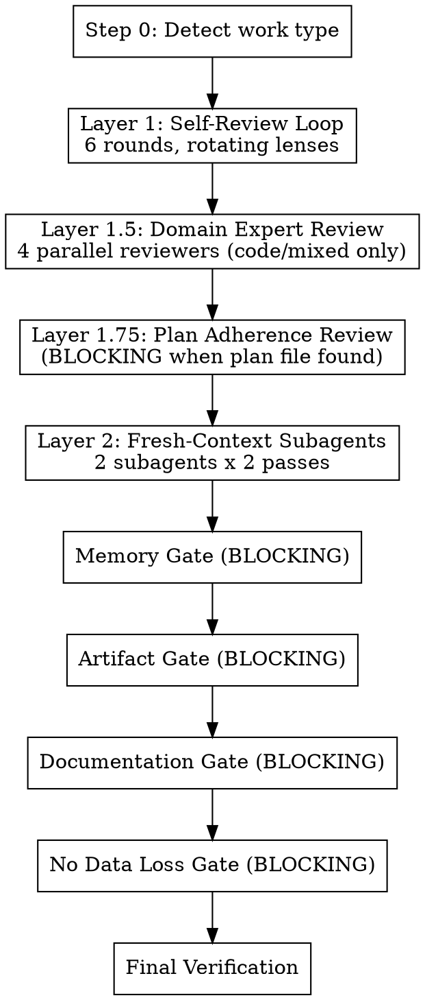

# Quality Gate

Automated multi-pass review with rotating adversarial lenses, fresh-context subagent reviews,
and blocking memory/artifact gates.

**Core principle:** One review pass catches ~60% of issues. Each additional pass with a DIFFERENT
lens catches more. Fresh-context review catches what same-context review cannot. Memory and
artifact gates prevent work from being lost.

## When to Invoke

**Always after:** implementation tasks, /swarm, /spawn, subagent work, research, planning,
significant artifact creation.

**Skip when:** pure conversation with no deliverables, or user explicitly opts out.

**Never skip "because it's trivial."** Small changes cause real failures. Don't rationalize
your way out of the process.

---

## Process Flow



---

## Step 0: Detect & Classify

Determine work type from session activity:

| Signal | Work Type |
|--------|-----------|
| `git diff` has results | **Code** |
| Plan file written to `{memory_dir}/plans/` | **Planning** |
| Research/analysis conversation, no file edits | **Research** |
| Edits to `.md`, `.yaml`, `.json`, `.toml` config | **Config/Artifact** |
| Short Q&A, no tool use | **Question** |
| Multiple of the above | **Mixed** (apply all relevant criteria) |

Select the lens set for the detected type (see `references/lens-rubrics.md`).

**Test plan discovery (Planning/Mixed/Code work types):** After classifying the work type,
discover the plan file using branch-header matching (same algorithm as Layer
1.75: search `{memory_dir}/plans/` for files whose `**Branch:**` header matches the current git
branch; fallback to branch slug prefix matching; use most recent by unix timestamp if multiple
match). If a plan file is found and it contains a `## Test Plan` section, read the `**Test Plan:**`
path annotation from that section. Normalize the path (resolve any `..` components, strip
trailing slashes) and verify it falls within `{memory_dir}/test-plans/`. If the path escapes
that directory, set `{plan_test_plan}` to empty string and log a warning:
"Warning: test plan path escapes {memory_dir}/test-plans/ boundary — setting {plan_test_plan}
to empty string." If the path is valid but the file does not exist, set `{plan_test_plan}` to
empty string (graceful fallback — no warning). If the path is valid and the file exists,
read the test plan file and store its content as `{plan_test_plan}`. This
value is available to all subsequent layers (Layer 1 Rounds 2 and 5, and Layer 2 Subagent A).
If no plan file is found for the current branch, set `{plan_test_plan}` to empty string.

---

## Layer 1: Self-Review Loop

**6 rounds (Round 6: Structural applies to Code/Mixed only). All rounds are mandatory — do not exit early.**

Each round uses a different adversarial lens. Rotating lenses prevent anchoring fatigue and ensure
comprehensive coverage from different angles.

### Lens Rotation

| Round | Lens | Core Question |
|-------|------|---------------|
| 1 | **Correctness** | What inputs produce wrong results? What assumptions are untested? |
| 2 | **Completeness** | What was requested but not delivered? Read the original request word-by-word. Includes documentation completeness (see below). For Planning/Mixed work: also check completeness against any UAT scenarios discovered in Step 0. |
| 3 | **Robustness** | How does this fail? Bad input, missing deps, concurrent access, edge cases? |
| 4 | **Simplicity (BLOCKING)** | What's over-engineered? What could be deleted? What's AI slop? Dead code, unnecessary abstractions, and unused imports are `needs-fix` — blocking. |
| 5 | **Adversarial** | You are a hostile reviewer. The author claims this is done. Prove them wrong. For Planning/Mixed work with UAT scenarios (loaded in Step 0): assume you are a hostile QA tester — can you construct inputs that would break each UAT scenario? If not, the scenarios may be under-specified. |
| 6 | **Structural** | What design flaws, race conditions, or failure modes exist in this system's architecture — not just in the current change, but in how it integrates? (Code/Mixed only) |

Table shows code lenses. Other work types adapt lens names — e.g., planning uses "Feasibility"
for Round 1, Q&A uses a reduced 3-round review. See `references/lens-rubrics.md` for all
work-type-specific lens prompts.

### Skill Integration Per Round

- **Round 1:** Spawn domain reviewers (`code-quality:security`, `code-quality:qa`, `code-quality:performance`) for code files. Use `sequential-thinking` MCP for decomposed reasoning.
- **Round 2:** Use `sequential-thinking` MCP. Apply first-principles: break original request into
  atomic requirements, check each independently.
- **Round 4 (BLOCKING):** Calculate net lines delta (`git diff --stat`). Spawn
  `code-quality:code-simplifier` with the delta as context. Apply the full checklist from
  `code-quality/references/simplification-checklist.md`. Dead code, unnecessary abstractions,
  and unused imports are `needs-fix` findings — they BLOCK proceeding to Round 5. Fix all
  such simplification findings before continuing. These are objectively wasteful, not
  judgment calls.
- **Round 5:** First-principles: "State the fundamental purpose in one sentence. Review against
  that purpose, not the structure you created."

**MCP tool availability:** If Serena (`think_about_*`) or `sequential-thinking` MCP tools are
unavailable, use extended thinking to perform the same metacognitive checks. The tools enforce
structured reasoning; without them, be explicit about pausing to reason through the same questions.

### Round Execution Protocol

Execute this protocol for EVERY round:

```
1. serena::think_about_task_adherence
   "Is this round's review still aligned with the original request?"

2. APPLY THE LENS
   Think through this EXHAUSTIVELY. Do not stop at the first issue.
   Check every modified file, every function, every edge case.
   Continue until you have genuinely run out of things to check —
   not until you feel like you've done enough.

   For this round's specific lens, use first-principles thinking:
   break the problem down to fundamental truths and rebuild
   your assessment from the ground up.

3. PROJECT RULES + CROSS-REFERENCE INTEGRITY (Round 2 only)
   a) Re-read CLAUDE.md and CONTRIBUTING.md (if they exist).
      Check every change against project-specific conventions:
      - Version bump rules (e.g., "always bump plugin versions in both files")
      - Commit message conventions
      - Required file updates (changelogs, manifests, registries)
      - Deployment/delivery requirements (will this change actually reach users?)
      - Any other project-specific rules that apply to this type of change

   b) Documentation completeness: check every change against the documentation
      triggers in `code-quality/references/documentation-taxonomy.md`. For each
      trigger that fires, verify the corresponding documentation surfaces were
      updated. Use the taxonomy's surface detection patterns to discover all
      surfaces, and its ecosystem-specific component discovery patterns to count
      on-disk components. Counts must match what's documented. A new component
      with no documentation entry is a completeness failure, same as a missing test.

   c) UAT coverage verification (Planning/Mixed only): if Step 0 loaded a
      non-empty `{plan_test_plan}`, for each scenario in the test plan: is
      there a corresponding planned task or test case in the plan? Will the
      planned work verify this scenario? A UAT scenario with no corresponding
      plan coverage is a completeness gap — treat as `needs-fix`.

   d) Cross-reference integrity: search the ENTIRE codebase for references
      to things you changed, renamed, or removed. Files you DIDN'T modify
      can have stale references to things you DID modify. Grep for:
      - Old names/values you replaced
      - Functions/skills/tools you renamed or removed
      - Version numbers that should match across files
      - Import paths, file references, cross-links

   This catches issues that no generic lens covers — project conventions
   and cross-file consistency are invisible to single-file review.

4. FIX ALL FINDINGS IMMEDIATELY
   Do not note issues for later. Do not say "could be improved."
   Fix them NOW. Every identified issue must result in an edit or
   a documented, specific blocker.

5. ACTION AUDIT
   Scan ALL output (yours and any subagent output) for
   identified-but-unactioned items:
   - "could be improved" / "might want to" / "consider"
   - "potential issue" / "noted for future" / "TODO"
   - "follow-up" / "out of scope" / "later"
   - "pre-existing" / "preexisting" / "known issue" / "existing failure"
   - "should be verified" / "needs to be confirmed" / "you should check"
   - "verify against your" / "please verify" / "you may want to update"
   - Any issue described without a corresponding fix
   - "v1" / "v2" / "future iteration" / "future enhancement" / "next version" / "phase N enhancement" / "deferred to future" / "out of scope for this implementation" (when used as self-scoping — legitimate software version references like "API v1" or "Pydantic v2" are not deferral)

   THE "DEFERRAL-TO-USER" TRAP:
   Saying "should be verified" or "you should check" is an admission that
   work needs doing — and a confession that you didn't do it. If it should
   be verified, verify it. If it needs checking, check it. If it needs
   confirming, confirm it. The user asked you to do the work, not to
   generate a checklist of work for them to do.
   - "The field ID should be verified against your instance" → Look it up.
   - "You may want to update the config" → Update it.
   - "This should be tested with..." → Test it.
   - "Needs to be confirmed" → Confirm it.
   Every "should be" is either done or documented as a specific blocker
   with why you couldn't do it yourself.

   THE "PREEXISTING" TRAP:
   Labeling something "preexisting" is NOT permission to ignore it.
   For every issue labeled preexisting or known:
   - WHY does it exist? Investigate the root cause, don't just note it.
   - Is it within scope of the current work? If your changes touch the
     same area, fix it.
   - Is it ACTUALLY preexisting? Verify by checking the baseline, not
     by assuming.
   - Even if truly preexisting and out of scope: document it as a
     concrete follow-up task, not a hand-wave.
   "4 pre-existing test failures" repeated without investigation is
   the same as ignoring 4 bugs.

   THE "SELF-SCOPING" TRAP:
   Labeling work as "v1" and deferring to "v2" is creating a permission
   gradient — the model decides what is "in scope" and uses version
   boundaries to justify skipping work. Scope decisions belong to the
   user via AskUserQuestion, not to the model via self-invented
   version labels.
   - "V2 Enhancements: [list]" → implement them or ask the user
   - "Scope: v1 vs. Deferred" → present as AskUserQuestion options
   - "Deferred (out of scope for v1)" → ask the user what to defer
   - "Future iteration: [feature]" → add it as a task or ask the user
   If the model claims "the user explicitly deferred this," verify the
   claim — cite the user's actual message. Fabricated user deferral
   is a violation.

   For EACH identified-but-unactioned item:
   - Can fix now? → Fix it.
   - Genuinely blocked? → Document the SPECIFIC blocker.
   - Deferred without justification? → Fix it.
   - User explicitly deferred it? → Leave it, cite the user's decision.

   For subagent/spawn output specifically:
   - Parse every subagent's last_assistant_message
   - Extract findings/issues/concerns mentioned
   - Cross-reference against actual edits made
   - The delta is "identified-but-unactioned" — fix or justify each one

6. serena::think_about_whether_you_are_done
   "Did I genuinely address everything this lens covers?"
   If no → fix remaining items before proceeding to next round.
```

### No Early Exit

**All 6 rounds are mandatory for Code and Mixed work types.** Each round uses a categorically
different lens — a clean Round 3 says nothing about Round 4 (Simplicity catches AI slop and
over-engineering), Round 5 (Adversarial catches what you rationalized away), and Round 6
(Structural catches integration issues invisible to single-component review).

For non-Code work types: Rounds 1-5 always run. Round 6 (Structural) is skipped since it
targets code architecture integration.

Do NOT exit early because a round "produced zero findings." Each lens catches categorically
different issues. The next round will find what this round cannot see.

---

## Layer 1.5: Domain Expert Review

**Applies to: Code and Mixed work types only.** Skip for Research, Planning, Config, and
Question work types.

Domain reviewers catch categories of issues that self-review lenses systematically miss:
security vulnerabilities require dedicated adversarial security reasoning; performance issues
require cost-model thinking; QA issues require test coverage analysis; code review issues
require holistic style and maintainability assessment. Layer 1 cannot replicate these because
each domain has its own expert heuristics.

**Layer 1.5 is NOT optional for code work.** Do not skip it because Layer 1 "seemed thorough."

### Trigger

Work type is **Code** or **Mixed** (with a code component).

### Reviewer Spawning (4 in parallel)

```
Spawn all 4 reviewers simultaneously:

Reviewer 1 — Security (code-quality:security):
  Agent(
    description="Security domain review",
    model="sonnet",
    prompt=<see references/subagent-prompts.md, Domain Reviewer: Security>
  )

Reviewer 2 — QA (code-quality:qa):
  Agent(
    description="QA domain review",
    model="sonnet",
    prompt=<see references/subagent-prompts.md, Domain Reviewer: QA>
  )

Reviewer 3 — Performance (code-quality:performance):
  Agent(
    description="Performance domain review",
    model="sonnet",
    prompt=<see references/subagent-prompts.md, Domain Reviewer: Performance>
  )

Reviewer 4 — Code Review (code-quality:code-reviewer):
  Agent(
    description="Code style and maintainability review",
    model="sonnet",
    prompt=<see references/subagent-prompts.md, Domain Reviewer: Code-Reviewer>
  )
```

Each reviewer receives:
- `git diff` of all changes
- The original user request (verbatim)
- CLAUDE.md / CONTRIBUTING.md project rules (if they exist)

### Synthesis Protocol

After all 4 reviewers complete, synthesize findings by classification
(see `code-quality/references/finding-classification.md`):

1. Collect all findings across the 4 reviewers
2. Fix all `needs-fix` findings immediately. Do not carry them forward.
3. For `needs-input` findings: present each individually via AskUserQuestion (one question
   per finding, batch up to 4 per call). Each question includes full context:
   `"[{id}] {description}\n\nLoE: {loe}\nDecision needed: {input_needed}"`
   with options "Fix" and "Defer". `multiSelect: false`. User decides per-finding.
   Fix approved items. Record deferred items with user's reason.
4. Do NOT proceed to Layer 2 until all `needs-fix` items are fixed and all
   `needs-input` items are resolved via user decision.

**Finding completion verification:** After fixing all `needs-fix` items and resolving all
`needs-input` items, verify completeness per `code-quality/references/finding-classification.md`
Verification Protocol: count total findings from all 4 reviewers vs (findings fixed +
user-deferred items). Delta > 0 → findings were silently dropped → fix them before Layer 2.

If AskUserQuestion is unavailable during synthesis, treat all `needs-input` findings as
`needs_context` - surface them in the quality gate output report (don't hide them, don't
block on them). Do NOT silently drop needs-input findings because the tool is unavailable.

**The synthesis step is not optional.** If you find yourself writing "domain review skipped"
or "findings noted for later," stop. Fix the needs-fix findings now.

---

## Layer 1.75: Plan Adherence Review

**Trigger:** Detect plan file. Search `{memory_dir}/plans/` for files whose `**Branch:**` header
matches the current git branch (exact string match). Fallback: match plan filenames where the
branch slug prefix matches the current branch slug. If multiple match, use the most recent by
unix timestamp. If none found, skip Layer 1.75 with note: "No plan file found — skipping plan
adherence check."

**Gate behavior:** When a plan IS found, Layer 1.75 is BLOCKING — cannot proceed to Layer 2
without completing plan verification. REQUIRED gate when a plan file exists.

**Execution:**

```
Agent(
  description="Plan adherence review",
  subagent_type="code-quality:plan-adherence",
  model="opus",
  prompt=<see references/subagent-prompts.md, Layer 1.75: Plan Adherence Reviewer>
)
```

Provide: plan file path, plan file content (`{plan_content}`), `git diff`, changed file list,
original user request. Store `{plan_content}` in context so Layer 2 Subagent A can receive it.

**Escalation handling:** If the plan-adherence agent triggers AskUserQuestion for unchecked
tasks, the quality gate waits for user responses. User can:
- Approve skip (`[SKIPPED by user]`)
- Mark blocked (`[BLOCKED: reason]`)
- Request implementation (quality gate fails, returns to implementation)

**Output:** Plan Adherence findings included in quality gate output report.

**Failure handling:** If the agent crashes or times out, retry once. If the second attempt
fails, mark as `[UNREVIEWED]` and proceed with note. If AskUserQuestion is unavailable, report
unchecked tasks as `needs-fix` findings.

---

## Layer 2: Fresh-Context Subagent Reviews

Same-context review has an anchoring ceiling. Fresh-context subagents break through it by
reviewing with no knowledge of your implementation decisions.

**Layer 2 is NEVER optional and NEVER substitutable.** Do not skip it because the change "seems
trivial" or subagents feel "disproportionate." Do not substitute it with prior review work —
swarm Phase 4 reviewers, domain reviewer output, or any other earlier review does NOT replace Layer 2.

**Why Layer 2 is distinct from all prior reviews:**
- **Timing:** Layer 2 reviews the FINAL state — after Layer 1 fixes, after any swarm Phase 5
  fixes, after everything. Prior reviews examined earlier, now-stale versions of the work.
- **Lens:** Layer 2 uses holistic lenses (completeness-vs-original-request, adversarial).
  Domain-specific reviewers (security, performance, QA) cover different ground.
- **Context:** Layer 2 subagents have zero knowledge of your implementation decisions,
  rationalizations, or "good enough" compromises. Prior reviewers in the same session share
  your context ceiling.

If you find yourself writing "SUBSTITUTED by" or "already covered by" for Layer 2, you are
rationalizing. Stop. Spawn the subagents. If the change is truly trivial, the subagents
finish quickly — that's cheap insurance, not wasted effort.

### Preparation

```
serena::think_about_collected_information
→ "What context do the subagents need to review effectively?"
```

Collect:
- `git diff` (for code) or artifact content (for non-code)
- The original user request (verbatim)
- Work type classification from Step 0
- CLAUDE.md / CONTRIBUTING.md project rules (if they exist) — subagents need these
  to check project convention compliance
- `{plan_content}` — plan content discovered by Layer 1.75 (if a plan was found). Pass to
  Subagent A (Completeness Reviewer) via the `{plan_content}` placeholder. Value is the plan
  file content or `'No plan file found.'` if Layer 1.75 was skipped.
- `{plan_test_plan}` — UAT test plan content loaded in Step 0. Pass to Subagent A
  (Completeness Reviewer) only. Value is the test plan file content or empty string if Step 0
  did not load a test plan. Subagent B does NOT receive this context.
  When `{plan_test_plan}` is empty string, omit the `UAT TEST PLAN` section entirely from the
  Subagent A prompt — do not render the heading, label, or empty placeholder.

### Subagent Execution (2 passes each — BOTH mandatory)

Each subagent runs TWO passes. Pass 2 is NOT optional — it catches issues the subagent
missed on Pass 1 and verifies your fixes didn't introduce new problems.

Pass 2 resumes the Pass 1 agent via `SendMessage` using the **agent ID** (not the name).
This preserves the agent's full conversation history from Pass 1. You MUST use the agent
ID returned in the Pass 1 result — using the agent name routes to a team inbox instead.

**CRITICAL — Pass 2 synchronization:** `SendMessage` is asynchronous — it returns immediately
but the agent's response arrives later as a teammate notification. You MUST wait for each
Pass 2 response before proceeding. Do NOT move to Memory Gate or any subsequent gate until
BOTH Pass 2 responses are received and all findings are fixed. "Message sent" is not
"response received." If the agent does not respond within 2 minutes, re-do the Pass 2 check
yourself: re-read the files you fixed and verify the fixes are semantically correct (not just
syntactically applied). A self-performed Pass 2 is better than a skipped one.

**Subagent A: Completeness Reviewer (opus)**

```
PASS 1:
  pass1_result = Agent(
    description="Completeness review",
    model="opus",
    prompt=<see references/subagent-prompts.md, Subagent A Pass 1>
  )
  → Save pass1_result.agentId
  → Fix ALL findings

PASS 2 (MANDATORY — do not skip):
  SendMessage(
    to=<agentId from Pass 1>,    ← MUST be agentId, not agent name
    message="Here are the fixes I made: {summary_of_fixes}.
             Review them. Also: what did YOU miss on your first pass?
             You had fresh eyes but still have blind spots. Look again.",
    summary="Pass 2 completeness re-review"
  )
  → WAIT for response (do not proceed to gates)
  → Fix ALL findings from Pass 2
```

**Subagent B: Adversarial Reviewer (opus)**

```
PASS 1:
  pass1_result = Agent(
    description="Adversarial review",
    model="opus",
    prompt=<see references/subagent-prompts.md, Subagent B Pass 1>
  )
  → Save pass1_result.agentId
  → Fix ALL findings

PASS 2 (MANDATORY — do not skip):
  SendMessage(
    to=<agentId from Pass 1>,    ← MUST be agentId, not agent name
    message="Here are the fixes: {summary_of_fixes}.
             Verify they're correct. What else breaks in production?",
    summary="Pass 2 adversarial re-review"
  )
  → WAIT for response (do not proceed to gates)
  → Fix ALL findings from Pass 2
```

**Why Pass 2 matters:** Pass 1 finds issues. You fix them. But fixes can introduce NEW
issues, and the subagent's first pass always misses something (fresh eyes still have blind
spots). Pass 2 catches both. Skipping it is like running tests once, making changes, and
not re-running them.

---

## Memory Gate (BLOCKING)

Cannot proceed past this gate without completing all applicable checks.
Memory that drifts from reality is worse than no memory.

Update project memory files per the content placement rules in
`code-quality/references/project-memory-reference.md`. Key surfaces:

| Memory Surface | Action |
|----------------|--------|
| **{memory_dir}/TODO.md** | Mark completed items `[x]` with date. Add new tasks. Remove stale items. |
| **{memory_dir}/PROJECT.md** | Document decisions, gotchas, architecture changes from this work. |
| **{memory_dir}/NEXT.md** | Update pointer to actual next task. |
| **{memory_dir}/SESSIONS.md** | Append 3-5 bullet summary (if session-end isn't imminent). |
| **{memory_dir}/plans/** | Delete completed plans. Update partial plans with progress. Delete superseded plans. |
| **claude-mem** | Search for related observations. Flag stale ones. Save new cross-session insights. |
| **Serena memories** | List, verify accuracy, update stale, write new project knowledge. |
| **Auto-memory** | Check project memory path, verify and update if relevant. |
| **{memory_dir}/LESSONS.md** | Check if current work produced principle-level lessons worth capturing. If human corrections or rejected approaches occurred, extract and write lessons before proceeding. |

**Skip conditions:** No memory dir found (per Directory Detection section of the reference) → skip
memory-dir checks. No plans directory → skip plan checks. claude-mem MCP unavailable → skip
claude-mem checks. Serena MCP unavailable → skip Serena memory checks. Pure question with no
persistent insights → skip memory saves. LESSONS.md doesn't exist → skip LESSONS check.

---

## Artifact Gate (BLOCKING)

Ensures work products aren't lost AND project conventions are satisfied.

| Work Type | Gate Criteria |
|-----------|---------------|
| **Code** | Tests pass. Changes committed, pushed, and PR created (or ready to — do not commit without user request). "In the working tree" is not sufficient. |
| **Planning** | Plan file written. Tasks concrete and actionable. No hand-waving. |
| **Research** | Key findings documented persistently (claude-mem, PROJECT.md, or file). |
| **Config** | Valid syntax. Consistent with existing patterns. Validated. |
| **Question** | No gate (unless answer revealed something worth persisting). |

**Project-specific checks (all work types) — final re-verification:**
Round 2 checked project rules during review. This gate re-verifies AFTER all fixes are applied
(Layer 1 fixes + Layer 2 subagent fixes may have changed the state). Re-read CLAUDE.md:
- Version bumps in plugin/package manifests (if project requires them)
- Registry/marketplace entries updated to match
- Will the change actually reach users after merge? (cache invalidation, version detection)
- Any required companion files (changelogs, migration guides, etc.)

**Upstream state verification (if a PR exists):**
Do not assume prior pushes landed or that the PR is still open. Verify:
- `mcp__github__pull_request_read` (preferred) or `gh pr view` — is the PR still open, or was it already merged/closed?
- `git log origin/main..HEAD` — does the branch contain ALL intended commits?
- If force-pushing to an already-merged branch, commits are silently orphaned
- After merge: `git log origin/main` — confirm the merge includes your changes

---

## Documentation Gate (BLOCKING)

Ensures documentation accurately reflects the current state of the codebase after all changes.
Cannot proceed past this gate without completing all applicable checks.

**This gate catches code→docs gaps** — features that exist on disk but aren't documented.
Round 2 checks docs→code (do documented claims match reality). This gate checks the inverse.

Use `code-quality/references/documentation-taxonomy.md` for all definitions.

| Check | Action |
|-------|--------|
| **Trigger check** | Do any changes in this work match documentation triggers (taxonomy § Triggers)? If no triggers fire, skip remaining checks. |
| **Component inventory** | Use ecosystem-specific discovery patterns (taxonomy § Component Discovery) to count on-disk components. Compare against documentation surfaces (taxonomy § Surfaces). Mismatches are blocking. |
| **Feature coverage** | For each trigger that fired: is there a corresponding documentation update? New component without doc entry = fail. Removed component with stale references = fail. |
| **Cross-surface consistency** | Apply consistency rules (taxonomy § Cross-Surface Consistency). All surfaces must agree on names, counts, and descriptions. |

**Skip conditions:** No documentation triggers fire (per taxonomy § "Changes that DO NOT require
documentation updates"). When in doubt, run the check.

---

## No Data Loss Gate (BLOCKING)

Ensures work artifacts are persisted to a **durable, externally-trackable location** — not just
in the conversation context or the local working tree. Cannot proceed past this gate without
confirming each applicable item.

**THE WORKING TREE TRAP:**
"Changes are in the working tree" is NOT a durable location. Working tree changes are:
- Lost on `git checkout`, `git stash`, branch switches, or worktree cleanup
- Invisible to other sessions, agents, or future conversations
- Not findable by anyone searching git history, PRs, or project memory
- Equivalent to "I wrote it on a sticky note" — it exists, but nobody will find it

Durable means: **another agent in a fresh session can find the work without being told where
to look.** PRs show up in `gh pr list`. Commits show up in `git log`. Plan files show up in
`{memory_dir}/plans/`. Project decisions show up in `{memory_dir}/PROJECT.md`. Conversation-only knowledge
and working-tree-only changes fail this test.

| Work Type | Persistence Check |
|-----------|-------------------|
| **Code** | Changes are on a **pushed feature branch with a PR** (verifiable via `gh pr view`). Not just committed locally — pushed and PR-visible. Uncommitted or committed-but-not-pushed work is NOT durable. |
| **Planning** | Plan written to `{memory_dir}/plans/{run-id}-<topic>.md`. New tasks added to `{memory_dir}/TODO.md`. Decisions documented in `{memory_dir}/PROJECT.md`. |
| **Research** | Findings written to `{memory_dir}/research/{run-id}-<topic>.md` (if memory dir exists), or to `{memory_dir}/PROJECT.md`, or saved to claude-mem. Key findings must survive session end. |
| **All types** | For each significant artifact, state WHERE it is persisted and HOW a future agent finds it. "It's in the working tree" or "it's in the conversation" fails this gate. |

**Skip conditions:** Pure question with no artifacts → skip. Work explicitly scoped as
"conversation only" by the user → skip.

---

## Final Verification

| Work Type | Verification |
|-----------|-------------|
| **Code** | Run test suite + lint. Compare against baseline. |
| **Planning** | Re-read plan end-to-end. Walk through mentally step-by-step. |
| **Research** | Re-read findings against original question. |
| **Config** | Validate syntax. Verify integration. |

Final check:
```
serena::think_about_whether_you_are_done → "Is this genuinely complete?"
```

---

## Output

```
━━━━━━━━━━━━━━━━━━━━━━━━━━━━━━━━━━━━━
QUALITY GATE
━━━━━━━━━━━━━━━━━━━━━━━━━━━━━━━━━━━━━

Work type: [code / research / plan / config / question / mixed]

Layer 1 — Self-Review:
  Rounds completed: [N/6]
  Issues found: [count]
  Issues fixed: [count]
  Identified-but-unactioned caught: [count]
  Project rules violations caught: [count]
  Round 4 (Simplicity gate): [PASS — 0 needs-fix | BLOCKED — N needs-fix fixed]
  Net lines delta: +[added] / -[removed] (net: [+/-X])

Layer 1.5 — Domain Expert Review: [N/A for non-code | COMPLETE]
  Security reviewer: [count] findings ([needs-fix/needs-input breakdown])
  QA reviewer: [count] findings ([needs-fix/needs-input breakdown])
  Performance reviewer: [count] findings ([needs-fix/needs-input breakdown])
  Code-reviewer: [count] findings ([needs-fix/needs-input breakdown])
  needs-fix fixed before Layer 2: [count]
  needs-input resolved via user decision: [count]

Layer 1.75 — Plan Adherence: [N/A (no plan) | COMPLETE]
  Plan file: [path or "not found"]
  Tasks verified: [N/M]
  Tasks escalated: [count] ([approved/blocked/returned-for-implementation])
  File structure: [MATCH | N discrepancies]

Layer 2 — Subagent Reviews:
  Subagent A (Completeness): [count] findings across 2 passes — agent ID: [id]
  Subagent B (Adversarial): [count] findings across 2 passes — agent ID: [id]
  (Layer 2 MUST show agent IDs. "SUBSTITUTED" or "N/A" is NEVER valid here.)

Memory Gate: [PASS / UPDATED]
  hack/ files: [updated / N/A]
  Plans: [N completed, N updated, N unchanged]
  Stale memories flagged: [count]
  New memories saved: [count]

Artifact Gate: [PASS / N/A]
  [work-type-specific status]

Documentation Gate: [PASS / SKIP / N/A]
  Components on disk: [count] | Documented: [count]
  Surfaces checked: [list]
  Gaps found: [count]

No Data Loss Gate: [PASS / N/A]
  [artifact persistence status]

Final Verification: [PASS / FAIL]

Overall: [PASS / NEEDS WORK]
[If NEEDS WORK: list what remains]
━━━━━━━━━━━━━━━━━━━━━━━━━━━━━━━━━━━━━
```

---

## Relationship to Other Skills

| Skill | Relationship |
|-------|-------------|
| `code-quality:code-simplifier` | Spawned in Round 4 (Simplicity lens, BLOCKING sub-gate) for dead code, unnecessary abstractions. Uses `references/simplification-checklist.md` and `references/dependency-evaluation.md`. |
| `code-quality:plan-adherence` | Spawned in Layer 1.75 for plan file verification (planning/mixed work types). |
| `code-quality:reflect` | Invoked for metacognitive checkpoints via Serena reflection tools. |
| `code-quality:security` | Spawned as domain reviewer in Layer 1.5 (code/mixed work types). |
| `code-quality:qa` | Spawned as domain reviewer in Layer 1.5 (code/mixed work types). |
| `code-quality:performance` | Spawned as domain reviewer in Layer 1.5 (code/mixed work types). |
| `code-quality:code-reviewer` | Spawned as domain reviewer in Layer 1.5 (code/mixed work types). |
| `session-end` | Complementary — quality-gate reviews accuracy; session-end does final save. |
| `swarm` Phase 7 | Invokes quality-gate as the final validation step. |
| `code-quality:fix` | Standalone finding fixer for non-swarm workflows. Not a source — quality-gate fixes findings inline. Suggest /quality-gate after /fix for verification. |

---

## Stop Hook Safety Net

A global Stop hook in `dev-guard` (`type: command`) catches premature completion claims that bypass
this skill. It uses a two-script architecture for speed: `stop-hook.py` (stdlib-only, <200ms)
performs deterministic triage — loop guard, transcript delta, signal detection (write tools, MCP
writes, completion claim regex, git diff hash change) — and fast-exits for low-signal cases.
When signals warrant deeper evaluation, it delegates to `stop-hook-llm.py` which calls
claude-sonnet-4-6 via Vertex AI with an adaptive prompt based on work type (code, research,
questions, planning) and trigger reasons. Fails open on any infrastructure error.
Uses `stop_hook_active` guard to prevent infinite loops.
