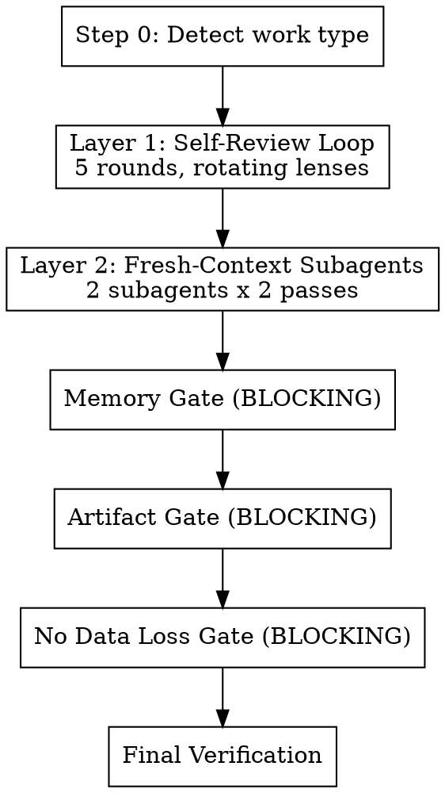

# Quality Gate

Automated multi-pass review with rotating adversarial lenses, fresh-context subagent reviews,
and blocking memory/artifact gates.

**Core principle:** One review pass catches ~60% of issues. Each additional pass with a DIFFERENT
lens catches more. Fresh-context review catches what same-context review cannot. Memory and
artifact gates prevent work from being lost.

## When to Invoke

**Always after:** implementation tasks, /swarm, /spawn, subagent work, research, planning,
significant artifact creation.

**Skip when:** pure conversation with no deliverables, or user explicitly opts out.

**Never skip "because it's trivial."** Small changes cause real failures. Don't rationalize
your way out of the process.

---

## Process Flow



---

## Step 0: Detect & Classify

Determine work type from session activity:

| Signal | Work Type |
|--------|-----------|
| `git diff` has results | **Code** |
| Plan file written to `hack/plans/` | **Planning** |
| Research/analysis conversation, no file edits | **Research** |
| Edits to `.md`, `.yaml`, `.json`, `.toml` config | **Config/Artifact** |
| Short Q&A, no tool use | **Question** |
| Multiple of the above | **Mixed** (apply all relevant criteria) |

Select the lens set for the detected type (see `references/lens-rubrics.md`).

---

## Layer 1: Self-Review Loop

**5 rounds maximum. Exit early if a round produces zero findings AND the action audit is clean.**

Each round uses a different adversarial lens. Rotating lenses prevent anchoring fatigue and ensure
comprehensive coverage from different angles.

### Lens Rotation

| Round | Lens | Core Question |
|-------|------|---------------|
| 1 | **Correctness** | What inputs produce wrong results? What assumptions are untested? |
| 2 | **Completeness** | What was requested but not delivered? Read the original request word-by-word. |
| 3 | **Robustness** | How does this fail? Bad input, missing deps, concurrent access, edge cases? |
| 4 | **Simplicity** | What's over-engineered? What could be deleted? What's AI slop? |
| 5 | **Adversarial** | You are a hostile reviewer. The author claims this is done. Prove them wrong. |

Table shows code lenses. Other work types adapt lens names — e.g., planning uses "Feasibility"
for Round 1, Q&A uses a reduced 3-round review. See `references/lens-rubrics.md` for all
work-type-specific lens prompts.

### Skill Integration Per Round

- **Round 1:** Invoke `sc:analyze` for code files. Use `sequential-thinking` MCP for decomposed reasoning.
- **Round 2:** Use `sequential-thinking` MCP. Apply first-principles: break original request into
  atomic requirements, check each independently.
- **Round 4:** Invoke `sc:improve` for dead code, unused imports, over-abstraction.
- **Round 5:** First-principles: "State the fundamental purpose in one sentence. Review against
  that purpose, not the structure you created."

**MCP tool availability:** If Serena (`think_about_*`) or `sequential-thinking` MCP tools are
unavailable, use extended thinking to perform the same metacognitive checks. The tools enforce
structured reasoning; without them, be explicit about pausing to reason through the same questions.

### Round Execution Protocol

Execute this protocol for EVERY round:

```
1. serena::think_about_task_adherence
   "Is this round's review still aligned with the original request?"

2. APPLY THE LENS
   Think through this EXHAUSTIVELY. Do not stop at the first issue.
   Check every modified file, every function, every edge case.
   Continue until you have genuinely run out of things to check —
   not until you feel like you've done enough.

   For this round's specific lens, use first-principles thinking:
   break the problem down to fundamental truths and rebuild
   your assessment from the ground up.

3. PROJECT RULES + CROSS-REFERENCE INTEGRITY (Round 2 only)
   a) Re-read CLAUDE.md and CONTRIBUTING.md (if they exist).
      Check every change against project-specific conventions:
      - Version bump rules (e.g., "always bump plugin versions in both files")
      - Commit message conventions
      - Required file updates (changelogs, manifests, registries)
      - Deployment/delivery requirements (will this change actually reach users?)
      - Any other project-specific rules that apply to this type of change

   b) Cross-reference integrity: search the ENTIRE codebase for references
      to things you changed, renamed, or removed. Files you DIDN'T modify
      can have stale references to things you DID modify. Grep for:
      - Old names/values you replaced
      - Functions/skills/tools you renamed or removed
      - Version numbers that should match across files
      - Import paths, file references, cross-links

   This catches issues that no generic lens covers — project conventions
   and cross-file consistency are invisible to single-file review.

4. FIX ALL FINDINGS IMMEDIATELY
   Do not note issues for later. Do not say "could be improved."
   Fix them NOW. Every identified issue must result in an edit or
   a documented, specific blocker.

5. ACTION AUDIT
   Scan ALL output (yours and any subagent output) for
   identified-but-unactioned items:
   - "could be improved" / "might want to" / "consider"
   - "potential issue" / "noted for future" / "TODO"
   - "follow-up" / "out of scope" / "later"
   - "pre-existing" / "preexisting" / "known issue" / "existing failure"
   - "should be verified" / "needs to be confirmed" / "you should check"
   - "verify against your" / "please verify" / "you may want to update"
   - Any issue described without a corresponding fix

   THE "DEFERRAL-TO-USER" TRAP:
   Saying "should be verified" or "you should check" is an admission that
   work needs doing — and a confession that you didn't do it. If it should
   be verified, verify it. If it needs checking, check it. If it needs
   confirming, confirm it. The user asked you to do the work, not to
   generate a checklist of work for them to do.
   - "The field ID should be verified against your instance" → Look it up.
   - "You may want to update the config" → Update it.
   - "This should be tested with..." → Test it.
   - "Needs to be confirmed" → Confirm it.
   Every "should be" is either done or documented as a specific blocker
   with why you couldn't do it yourself.

   THE "PREEXISTING" TRAP:
   Labeling something "preexisting" is NOT permission to ignore it.
   For every issue labeled preexisting or known:
   - WHY does it exist? Investigate the root cause, don't just note it.
   - Is it within scope of the current work? If your changes touch the
     same area, fix it.
   - Is it ACTUALLY preexisting? Verify by checking the baseline, not
     by assuming.
   - Even if truly preexisting and out of scope: document it as a
     concrete follow-up task, not a hand-wave.
   "4 pre-existing test failures" repeated without investigation is
   the same as ignoring 4 bugs.

   For EACH identified-but-unactioned item:
   - Can fix now? → Fix it.
   - Genuinely blocked? → Document the SPECIFIC blocker.
   - Deferred without justification? → Fix it.
   - User explicitly deferred it? → Leave it, cite the user's decision.

   For subagent/spawn output specifically:
   - Parse every subagent's last_assistant_message
   - Extract findings/issues/concerns mentioned
   - Cross-reference against actual edits made
   - The delta is "identified-but-unactioned" — fix or justify each one

6. serena::think_about_whether_you_are_done
   "Did I genuinely address everything this lens covers?"
   If no → fix remaining items before proceeding to next round.
```

### Early Exit

**Rounds 1-3 always run.** Correctness, Completeness, and Robustness are critical lenses that
catch categorically different issues — a clean Round 1 says nothing about Round 2.

Starting from Round 4: if a round produces zero findings AND the action audit is clean, skip
remaining rounds. Do NOT exit early just because you "feel done" — the `think_about_whether_you_are_done`
tool must confirm.

---

## Layer 2: Fresh-Context Subagent Reviews

Same-context review has an anchoring ceiling. Fresh-context subagents break through it by
reviewing with no knowledge of your implementation decisions.

**Layer 2 is NEVER optional and NEVER substitutable.** Do not skip it because the change "seems
trivial" or subagents feel "disproportionate." Do not substitute it with prior review work —
swarm Phase 4 reviewers, sc:analyze output, or any other earlier review does NOT replace Layer 2.

**Why Layer 2 is distinct from all prior reviews:**
- **Timing:** Layer 2 reviews the FINAL state — after Layer 1 fixes, after any swarm Phase 5
  fixes, after everything. Prior reviews examined earlier, now-stale versions of the work.
- **Lens:** Layer 2 uses holistic lenses (completeness-vs-original-request, adversarial).
  Domain-specific reviewers (security, performance, QA) cover different ground.
- **Context:** Layer 2 subagents have zero knowledge of your implementation decisions,
  rationalizations, or "good enough" compromises. Prior reviewers in the same session share
  your context ceiling.

If you find yourself writing "SUBSTITUTED by" or "already covered by" for Layer 2, you are
rationalizing. Stop. Spawn the subagents. If the change is truly trivial, the subagents
finish quickly — that's cheap insurance, not wasted effort.

### Preparation

```
serena::think_about_collected_information
→ "What context do the subagents need to review effectively?"
```

Collect:
- `git diff` (for code) or artifact content (for non-code)
- The original user request (verbatim)
- Work type classification from Step 0
- CLAUDE.md / CONTRIBUTING.md project rules (if they exist) — subagents need these
  to check project convention compliance

### Subagent Execution (2 passes each — BOTH mandatory)

Each subagent runs TWO passes. Pass 2 is NOT optional — it catches issues the subagent
missed on Pass 1 and verifies your fixes didn't introduce new problems. You MUST save
the agent ID from Pass 1 to resume for Pass 2.

**Subagent A: Completeness Reviewer (opus)**

```
PASS 1:
  agent_result = Agent(
    description="Completeness review",
    model="opus",
    prompt=<see references/subagent-prompts.md, Subagent A Pass 1>
  )
  → Save agent_result.agentId
  → Fix ALL findings

PASS 2 (MANDATORY — do not skip):
  Agent(
    description="Completeness re-review",
    resume=<saved agentId from Pass 1>,
    prompt="Here are the fixes I made: {summary_of_fixes}.
            Review them. Also: what did YOU miss on your first pass?
            You had fresh eyes but still have blind spots. Look again."
  )
  → Fix ALL findings from Pass 2
```

**Subagent B: Adversarial Reviewer (opus)**

```
PASS 1:
  agent_result = Agent(
    description="Adversarial review",
    model="opus",
    prompt=<see references/subagent-prompts.md, Subagent B Pass 1>
  )
  → Save agent_result.agentId
  → Fix ALL findings

PASS 2 (MANDATORY — do not skip):
  Agent(
    description="Adversarial re-review",
    resume=<saved agentId from Pass 1>,
    prompt="Here are the fixes: {summary_of_fixes}.
            Verify they're correct. What else breaks in production?"
  )
  → Fix ALL findings from Pass 2
```

**Why Pass 2 matters:** Pass 1 finds issues. You fix them. But fixes can introduce NEW
issues, and the subagent's first pass always misses something (fresh eyes still have blind
spots). Pass 2 catches both. Skipping it is like running tests once, making changes, and
not re-running them.

---

## Memory Gate (BLOCKING)

Cannot proceed past this gate without completing all applicable checks.
Memory that drifts from reality is worse than no memory.

| Memory Surface | Action |
|----------------|--------|
| **hack/TODO.md** | Mark completed items `[x]` with date. Add new tasks. Remove stale items. |
| **hack/PROJECT.md** | Document decisions, gotchas, architecture changes from this work. |
| **hack/NEXT.md** | Update pointer to actual next task. |
| **hack/SESSIONS.md** | Append 3-5 bullet summary (if session-end isn't imminent). |
| **hack/plans/** | Delete completed plans. Update partial plans with progress. Delete superseded plans. |
| **claude-mem** | Search for related observations. Flag stale ones. Save new cross-session insights. |
| **Serena memories** | List, verify accuracy, update stale, write new project knowledge. |
| **Auto-memory** | Check project memory path, verify and update if relevant. |

**Skip conditions:** hack/ doesn't exist → skip hack/ checks. No plans directory → skip plan
checks. claude-mem MCP unavailable → skip claude-mem checks. Serena MCP unavailable → skip
Serena memory checks. Pure question with no persistent insights → skip memory saves.

---

## Artifact Gate (BLOCKING)

Ensures work products aren't lost AND project conventions are satisfied.

| Work Type | Gate Criteria |
|-----------|---------------|
| **Code** | Tests pass. Changes on a feature branch (or ready to commit — do not commit without user request). |
| **Planning** | Plan file written. Tasks concrete and actionable. No hand-waving. |
| **Research** | Key findings documented persistently (claude-mem, PROJECT.md, or file). |
| **Config** | Valid syntax. Consistent with existing patterns. Validated. |
| **Question** | No gate (unless answer revealed something worth persisting). |

**Project-specific checks (all work types) — final re-verification:**
Round 2 checked project rules during review. This gate re-verifies AFTER all fixes are applied
(Layer 1 fixes + Layer 2 subagent fixes may have changed the state). Re-read CLAUDE.md:
- Version bumps in plugin/package manifests (if project requires them)
- Registry/marketplace entries updated to match
- Will the change actually reach users after merge? (cache invalidation, version detection)
- Any required companion files (changelogs, migration guides, etc.)

**Upstream state verification (if a PR exists):**
Do not assume prior pushes landed or that the PR is still open. Verify:
- `gh pr view` — is the PR still open, or was it already merged/closed?
- `git log origin/main..HEAD` — does the branch contain ALL intended commits?
- If force-pushing to an already-merged branch, commits are silently orphaned
- After merge: `git log origin/main` — confirm the merge includes your changes

---

## No Data Loss Gate (BLOCKING)

Ensures work artifacts are persisted to a durable, findable location — not just in the
conversation context. Cannot proceed past this gate without confirming each applicable item.

| Work Type | Persistence Check |
|-----------|-------------------|
| **Code** | Changes are committed to a feature branch OR explicitly staged and user is informed. No committed-but-not-pushed-and-forgotten work. |
| **Planning** | Plan written to `hack/plans/YYYY-MM-DD-<topic>.md`. New tasks added to `hack/TODO.md`. |
| **Research** | Findings written to `hack/research/YYYY-MM-DD-<topic>.md` (if hack/ exists), otherwise to PROJECT.md or saved to claude-mem. Key claims are not conversation-only. |
| **All types** | Every significant artifact has a clear, durable home. Nothing important exists only in the conversation. |

**Skip conditions:** Pure question with no artifacts → skip. Work explicitly scoped as
"conversation only" by the user → skip.

---

## Final Verification

| Work Type | Verification |
|-----------|-------------|
| **Code** | Run test suite + lint. Compare against baseline. |
| **Planning** | Re-read plan end-to-end. Walk through mentally step-by-step. |
| **Research** | Re-read findings against original question. |
| **Config** | Validate syntax. Verify integration. |

Final check:
```
serena::think_about_whether_you_are_done → "Is this genuinely complete?"
```

---

## Output

```
━━━━━━━━━━━━━━━━━━━━━━━━━━━━━━━━━━━━━
QUALITY GATE
━━━━━━━━━━━━━━━━━━━━━━━━━━━━━━━━━━━━━

Work type: [code / research / plan / config / question / mixed]

Layer 1 — Self-Review:
  Rounds completed: [N/5]
  Issues found: [count]
  Issues fixed: [count]
  Identified-but-unactioned caught: [count]
  Project rules violations caught: [count]

Layer 2 — Subagent Reviews:
  Subagent A (Completeness): [count] findings across 2 passes — agent ID: [id]
  Subagent B (Adversarial): [count] findings across 2 passes — agent ID: [id]
  (Layer 2 MUST show agent IDs. "SUBSTITUTED" or "N/A" is NEVER valid here.)

Memory Gate: [PASS / UPDATED]
  hack/ files: [updated / N/A]
  Plans: [N completed, N updated, N unchanged]
  Stale memories flagged: [count]
  New memories saved: [count]

Artifact Gate: [PASS / N/A]
  [work-type-specific status]

No Data Loss Gate: [PASS / N/A]
  [artifact persistence status]

Final Verification: [PASS / FAIL]

Overall: [PASS / NEEDS WORK]
[If NEEDS WORK: list what remains]
━━━━━━━━━━━━━━━━━━━━━━━━━━━━━━━━━━━━━
```

---

## Relationship to Other Skills

| Skill | Relationship |
|-------|-------------|
| `sc:analyze` | Invoked in Round 1 (Correctness lens) for code files. |
| `sc:improve` | Invoked in Round 4 (Simplicity lens) for dead code removal. |
| `sc:reflect` | Replaced by Serena metacognitive tools (more targeted). |
| `verification-before-completion` | Embedded in Final Verification step. |
| `session-end` | Complementary — quality-gate reviews accuracy; session-end does final save. |
| `swarm` Phase 7 | Invokes quality-gate as the final validation step. |

---

## Stop Hook Safety Net

A global Stop hook in `dev-guard` (`type: command`) catches premature completion claims that bypass
this skill. It uses a two-script architecture for speed: `stop-hook.py` (stdlib-only, <200ms)
performs deterministic triage — loop guard, transcript delta, signal detection (write tools, MCP
writes, completion claim regex, git diff hash change) — and fast-exits for low-signal cases.
When signals warrant deeper evaluation, it delegates to `stop-hook-llm.py` which calls
claude-sonnet-4-6 via Vertex AI with an adaptive prompt based on work type (code, research,
questions, planning) and trigger reasons. Fails open on any infrastructure error.
Uses `stop_hook_active` guard to prevent infinite loops.
