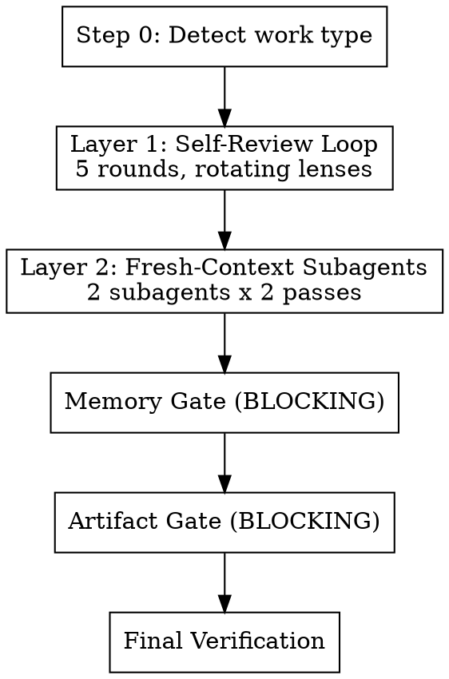

# Quality Gate

Automated multi-pass review with rotating adversarial lenses, fresh-context subagent reviews,
and blocking memory/artifact gates.

**Core principle:** One review pass catches ~60% of issues. Each additional pass with a DIFFERENT
lens catches more. Fresh-context review catches what same-context review cannot. Memory and
artifact gates prevent work from being lost.

## When to Invoke

**Always after:** implementation tasks, /swarm, /spawn, subagent work, research, planning,
significant artifact creation.

**Skip when:** pure conversation with no deliverables, single-line trivial fixes, or user opts out.

---

## Process Flow



---

## Step 0: Detect & Classify

Determine work type from session activity:

| Signal | Work Type |
|--------|-----------|
| `git diff` has results | **Code** |
| Plan file written to `hack/plans/` | **Planning** |
| Research/analysis conversation, no file edits | **Research** |
| Edits to `.md`, `.yaml`, `.json`, `.toml` config | **Config/Artifact** |
| Short Q&A, no tool use | **Question** |
| Multiple of the above | **Mixed** (apply all relevant criteria) |

Select the lens set for the detected type (see `references/lens-rubrics.md`).

---

## Layer 1: Self-Review Loop

**5 rounds maximum. Exit early if a round produces zero findings AND the action audit is clean.**

Each round uses a different adversarial lens. Rotating lenses prevent anchoring fatigue and ensure
comprehensive coverage from different angles.

### Lens Rotation

| Round | Lens | Core Question |
|-------|------|---------------|
| 1 | **Correctness** | What inputs produce wrong results? What assumptions are untested? |
| 2 | **Completeness** | What was requested but not delivered? Read the original request word-by-word. |
| 3 | **Robustness** | How does this fail? Bad input, missing deps, concurrent access, edge cases? |
| 4 | **Simplicity** | What's over-engineered? What could be deleted? What's AI slop? |
| 5 | **Adversarial** | You are a hostile reviewer. The author claims this is done. Prove them wrong. |

Table shows code lenses. Other work types adapt lens names — e.g., planning uses "Feasibility"
for Round 1, Q&A uses a reduced 3-round review. See `references/lens-rubrics.md` for all
work-type-specific lens prompts.

### Skill Integration Per Round

- **Round 1:** Invoke `sc:analyze` for code files. Use `sequential-thinking` MCP for decomposed reasoning.
- **Round 2:** Use `sequential-thinking` MCP. Apply first-principles: break original request into
  atomic requirements, check each independently.
- **Round 4:** Invoke `sc:improve` for dead code, unused imports, over-abstraction.
- **Round 5:** First-principles: "State the fundamental purpose in one sentence. Review against
  that purpose, not the structure you created."

**MCP tool availability:** If Serena (`think_about_*`) or `sequential-thinking` MCP tools are
unavailable, use extended thinking to perform the same metacognitive checks. The tools enforce
structured reasoning; without them, be explicit about pausing to reason through the same questions.

### Round Execution Protocol

Execute this protocol for EVERY round:

```
1. serena::think_about_task_adherence
   "Is this round's review still aligned with the original request?"

2. APPLY THE LENS
   Think through this EXHAUSTIVELY. Do not stop at the first issue.
   Check every modified file, every function, every edge case.
   Continue until you have genuinely run out of things to check —
   not until you feel like you've done enough.

   For this round's specific lens, use first-principles thinking:
   break the problem down to fundamental truths and rebuild
   your assessment from the ground up.

3. FIX ALL FINDINGS IMMEDIATELY
   Do not note issues for later. Do not say "could be improved."
   Fix them NOW. Every identified issue must result in an edit or
   a documented, specific blocker.

4. ACTION AUDIT
   Scan ALL output (yours and any subagent output) for
   identified-but-unactioned items:
   - "could be improved" / "might want to" / "consider"
   - "potential issue" / "noted for future" / "TODO"
   - "follow-up" / "out of scope" / "later"
   - Any issue described without a corresponding fix

   For EACH identified-but-unactioned item:
   - Can fix now? → Fix it.
   - Genuinely blocked? → Document the SPECIFIC blocker.
   - Deferred without justification? → Fix it.
   - User explicitly deferred it? → Leave it, cite the user's decision.

   For subagent/spawn output specifically:
   - Parse every subagent's last_assistant_message
   - Extract findings/issues/concerns mentioned
   - Cross-reference against actual edits made
   - The delta is "identified-but-unactioned" — fix or justify each one

5. serena::think_about_whether_you_are_done
   "Did I genuinely address everything this lens covers?"
   If no → fix remaining items before proceeding to next round.
```

### Early Exit

**Rounds 1-3 always run.** Correctness, Completeness, and Robustness are critical lenses that
catch categorically different issues — a clean Round 1 says nothing about Round 2.

Starting from Round 4: if a round produces zero findings AND the action audit is clean, skip
remaining rounds. Do NOT exit early just because you "feel done" — the `think_about_whether_you_are_done`
tool must confirm.

---

## Layer 2: Fresh-Context Subagent Reviews

Same-context review has an anchoring ceiling. Fresh-context subagents break through it by
reviewing with no knowledge of your implementation decisions.

### Preparation

```
serena::think_about_collected_information
→ "What context do the subagents need to review effectively?"
```

Collect:
- `git diff` (for code) or artifact content (for non-code)
- The original user request (verbatim)
- Work type classification from Step 0

### Subagent A: Completeness Reviewer (opus)

**Pass 1:** Spawn with diff/artifact + original request.
Focus: requirements coverage, deferred work, action verification.
See `references/subagent-prompts.md` for the full prompt template.

Fix all findings from Subagent A.

**Pass 2:** Resume Subagent A (preserves its context).
Prompt: "Here are the fixes I made. Review them. Also: what did YOU miss on your
first pass? You had fresh eyes but still have blind spots. Look again."

Fix all findings from Pass 2.

### Subagent B: Adversarial Reviewer (opus)

**Pass 1:** Spawn with diff/artifact + original request.
Focus: bugs, security, edge cases, production failures.
See `references/subagent-prompts.md` for the full prompt template.

Fix all findings from Subagent B.

**Pass 2:** Resume Subagent B.
Prompt: "Here are the fixes. Verify they're correct. What else breaks in production?"

Fix all findings from Pass 2.

---

## Memory Gate (BLOCKING)

Cannot proceed past this gate without completing all applicable checks.
Memory that drifts from reality is worse than no memory.

| Memory Surface | Action |
|----------------|--------|
| **hack/TODO.md** | Mark completed items `[x]` with date. Add new tasks. Remove stale items. |
| **hack/PROJECT.md** | Document decisions, gotchas, architecture changes from this work. |
| **hack/NEXT.md** | Update pointer to actual next task. |
| **hack/SESSIONS.md** | Append 3-5 bullet summary (if session-end isn't imminent). |
| **hack/plans/** | Delete completed plans. Update partial plans with progress. Delete superseded plans. |
| **claude-mem** | Search for related observations. Flag stale ones. Save new cross-session insights. |
| **Serena memories** | List, verify accuracy, update stale, write new project knowledge. |
| **Auto-memory** | Check project memory path, verify and update if relevant. |

**Skip conditions:** hack/ doesn't exist → skip hack/ checks. No plans directory → skip plan
checks. claude-mem MCP unavailable → skip claude-mem checks. Serena MCP unavailable → skip
Serena memory checks. Pure question with no persistent insights → skip memory saves.

---

## Artifact Gate (BLOCKING)

Ensures work products aren't lost.

| Work Type | Gate Criteria |
|-----------|---------------|
| **Code** | Tests pass. Changes on a feature branch (or ready to commit — do not commit without user request). |
| **Planning** | Plan file written. Tasks concrete and actionable. No hand-waving. |
| **Research** | Key findings documented persistently (claude-mem, PROJECT.md, or file). |
| **Config** | Valid syntax. Consistent with existing patterns. Validated. |
| **Question** | No gate (unless answer revealed something worth persisting). |

---

## Final Verification

| Work Type | Verification |
|-----------|-------------|
| **Code** | Run test suite + lint. Compare against baseline. |
| **Planning** | Re-read plan end-to-end. Walk through mentally step-by-step. |
| **Research** | Re-read findings against original question. |
| **Config** | Validate syntax. Verify integration. |

Final check:
```
serena::think_about_whether_you_are_done → "Is this genuinely complete?"
```

---

## Output

```
━━━━━━━━━━━━━━━━━━━━━━━━━━━━━━━━━━━━━
QUALITY GATE
━━━━━━━━━━━━━━━━━━━━━━━━━━━━━━━━━━━━━

Work type: [code / research / plan / config / question / mixed]

Layer 1 — Self-Review:
  Rounds completed: [N/5]
  Issues found: [count]
  Issues fixed: [count]
  Identified-but-unactioned caught: [count]

Layer 2 — Subagent Reviews:
  Subagent A (Completeness): [count] findings across 2 passes
  Subagent B (Adversarial): [count] findings across 2 passes

Memory Gate: [PASS / UPDATED]
  hack/ files: [updated / N/A]
  Plans: [N completed, N updated, N unchanged]
  Stale memories flagged: [count]
  New memories saved: [count]

Artifact Gate: [PASS / N/A]
  [work-type-specific status]

Final Verification: [PASS / FAIL]

Overall: [PASS / NEEDS WORK]
[If NEEDS WORK: list what remains]
━━━━━━━━━━━━━━━━━━━━━━━━━━━━━━━━━━━━━
```

---

## Relationship to Other Skills

| Skill | Relationship |
|-------|-------------|
| `sc:analyze` | Invoked in Round 1 (Correctness lens) for code files. |
| `sc:improve` | Invoked in Round 4 (Simplicity lens) for dead code removal. |
| `sc:reflect` | Replaced by Serena metacognitive tools (more targeted). |
| `verification-before-completion` | Embedded in Final Verification step. |
| `session-end` | Complementary — quality-gate reviews accuracy; session-end does final save. |
| `swarm` Phase 7 | Invokes quality-gate as the final validation step. |

---

## Stop Hook Safety Net

A global Stop hook in `dev-guard` catches premature completion claims that bypass this skill.
It fires on every response, verifying tests ran, no unresolved TODOs, all requirements addressed,
and memories updated. No iteration cap — if Claude can't satisfy the checks, it loops until it
asks the user for help.
